# WebSocket API

LeirEye usa WebSocket para streaming de paquetes en tiempo real.

## 🔌 Conexión

### URL

```
ws://localhost:8000/ws/capture
```

### Autenticación

Envía el token JWT como query parameter:

```
ws://localhost:8000/ws/capture?token=eyJhbGci...
```

O en el primer mensaje después de conectar:

```json
{
  "type": "auth",
  "token": "eyJhbGciOiJIUzI1NiIs..."
}
```

## 📨 Tipos de Mensajes

### Cliente → Servidor

| Tipo | Descripción |
|------|-------------|
| `auth` | Autenticar conexión |
| `subscribe` | Suscribirse a eventos |
| `unsubscribe` | Cancelar suscripción |
| `ping` | Keep-alive |

### Servidor → Cliente

| Tipo | Descripción |
|------|-------------|
| `auth_success` | Autenticación exitosa |
| `auth_error` | Error de autenticación |
| `packet` | Paquete capturado |
| `stats` | Actualización de estadísticas |
| `status` | Cambio de estado de captura |
| `pong` | Respuesta a ping |
| `error` | Error general |

## 📝 Ejemplos de Mensajes

### Autenticación

**Cliente:**
```json
{
  "type": "auth",
  "token": "eyJhbGciOiJIUzI1NiIs..."
}
```

**Servidor (éxito):**
```json
{
  "type": "auth_success",
  "user": {
    "id": 1,
    "username": "admin",
    "role": "ADMIN"
  }
}
```

**Servidor (error):**
```json
{
  "type": "auth_error",
  "message": "Invalid or expired token"
}
```

### Suscribirse a Paquetes

**Cliente:**
```json
{
  "type": "subscribe",
  "channel": "packets",
  "filters": {
    "protocol": "TCP",
    "port": 443
  }
}
```

**Servidor (confirmación):**
```json
{
  "type": "subscribed",
  "channel": "packets",
  "filters": {
    "protocol": "TCP",
    "port": 443
  }
}
```

### Recibir Paquetes

**Servidor:**
```json
{
  "type": "packet",
  "data": {
    "id": 42,
    "timestamp": "2024-01-20T10:30:01.123Z",
    "src_ip": "192.168.1.100",
    "dst_ip": "142.250.185.14",
    "src_port": 54321,
    "dst_port": 443,
    "protocol": "TCP",
    "length": 1500,
    "flags": ["ACK", "PSH"],
    "info": "HTTPS"
  }
}
```

### Estadísticas en Tiempo Real

**Servidor (cada segundo):**
```json
{
  "type": "stats",
  "data": {
    "packets_total": 1567,
    "packets_per_second": 45,
    "bytes_per_second": 125000,
    "protocols": {
      "TCP": 35,
      "UDP": 10
    }
  }
}
```

### Estado de Captura

**Servidor:**
```json
{
  "type": "status",
  "data": {
    "is_capturing": true,
    "interface": "en0",
    "started_at": "2024-01-20T10:30:00Z",
    "packets_captured": 1567
  }
}
```

## 🔄 Flujo Típico

```mermaid
sequenceDiagram
    participant C as Cliente
    participant S as Servidor
    
    C->>S: Conectar WebSocket
    S->>C: Conexión establecida
    
    C->>S: {"type": "auth", "token": "..."}
    S->>C: {"type": "auth_success", ...}
    
    C->>S: {"type": "subscribe", "channel": "packets"}
    S->>C: {"type": "subscribed", ...}
    
    loop Mientras captura activa
        S->>C: {"type": "packet", "data": {...}}
        S->>C: {"type": "packet", "data": {...}}
        S->>C: {"type": "stats", "data": {...}}
    end
    
    C->>S: {"type": "unsubscribe", "channel": "packets"}
    S->>C: {"type": "unsubscribed", ...}
    
    C->>S: Cerrar conexión
```



## 🛠️ Implementación

### JavaScript/TypeScript

```typescript
class LeirEyeWebSocket {
  private ws: WebSocket;
  private token: string;
  private reconnectAttempts = 0;
  
  constructor(token: string) {
    this.token = token;
    this.connect();
  }
  
  private connect() {
    this.ws = new WebSocket(`ws://localhost:8000/ws/capture?token=${this.token}`);
    
    this.ws.onopen = () => {
      console.log('Connected to LeirEye');
      this.reconnectAttempts = 0;
      this.subscribe('packets');
    };
    
    this.ws.onmessage = (event) => {
      const message = JSON.parse(event.data);
      this.handleMessage(message);
    };
    
    this.ws.onclose = () => {
      console.log('Disconnected, reconnecting...');
      this.reconnect();
    };
    
    this.ws.onerror = (error) => {
      console.error('WebSocket error:', error);
    };
  }
  
  private handleMessage(message: any) {
    switch (message.type) {
      case 'packet':
        this.onPacket(message.data);
        break;
      case 'stats':
        this.onStats(message.data);
        break;
      case 'status':
        this.onStatus(message.data);
        break;
      case 'error':
        console.error('Server error:', message.message);
        break;
    }
  }
  
  private reconnect() {
    if (this.reconnectAttempts < 5) {
      this.reconnectAttempts++;
      setTimeout(() => this.connect(), 1000 * this.reconnectAttempts);
    }
  }
  
  subscribe(channel: string, filters?: any) {
    this.send({
      type: 'subscribe',
      channel,
      filters
    });
  }
  
  unsubscribe(channel: string) {
    this.send({
      type: 'unsubscribe',
      channel
    });
  }
  
  private send(data: any) {
    if (this.ws.readyState === WebSocket.OPEN) {
      this.ws.send(JSON.stringify(data));
    }
  }
  
  // Callbacks para sobrescribir
  onPacket(packet: any) {
    console.log('Packet:', packet);
  }
  
  onStats(stats: any) {
    console.log('Stats:', stats);
  }
  
  onStatus(status: any) {
    console.log('Status:', status);
  }
  
  close() {
    this.ws.close();
  }
}

// Uso
const ws = new LeirEyeWebSocket('eyJhbGci...');

ws.onPacket = (packet) => {
  // Agregar paquete a la tabla
  addPacketToTable(packet);
};

ws.onStats = (stats) => {
  // Actualizar gráficos
  updateCharts(stats);
};
```

### Python

```python
import asyncio
import websockets
import json

class LeirEyeWebSocket:
    def __init__(self, token: str):
        self.token = token
        self.uri = f"ws://localhost:8000/ws/capture?token={token}"
    
    async def connect(self):
        async with websockets.connect(self.uri) as ws:
            # Suscribirse a paquetes
            await ws.send(json.dumps({
                "type": "subscribe",
                "channel": "packets"
            }))
            
            # Recibir mensajes
            async for message in ws:
                data = json.loads(message)
                await self.handle_message(data)
    
    async def handle_message(self, message: dict):
        msg_type = message.get("type")
        
        if msg_type == "packet":
            await self.on_packet(message["data"])
        elif msg_type == "stats":
            await self.on_stats(message["data"])
        elif msg_type == "error":
            print(f"Error: {message.get('message')}")
    
    async def on_packet(self, packet: dict):
        print(f"Packet: {packet['src_ip']} -> {packet['dst_ip']}")
    
    async def on_stats(self, stats: dict):
        print(f"Stats: {stats['packets_per_second']} pps")

# Uso
async def main():
    client = LeirEyeWebSocket("eyJhbGci...")
    await client.connect()

asyncio.run(main())
```

## ⚙️ Opciones de Suscripción

### Filtros de Paquetes

```json
{
  "type": "subscribe",
  "channel": "packets",
  "filters": {
    "protocol": "TCP",
    "src_ip": "192.168.1.100",
    "dst_ip": "8.8.8.8",
    "port": 443,
    "min_length": 100
  }
}
```

### Frecuencia de Stats

```json
{
  "type": "subscribe",
  "channel": "stats",
  "options": {
    "interval_ms": 1000
  }
}
```

## 🔧 Manejo de Errores

### Reconexión

El cliente debe implementar lógica de reconexión:

```javascript
const RECONNECT_DELAYS = [1000, 2000, 5000, 10000, 30000];

function reconnect(attempt = 0) {
  const delay = RECONNECT_DELAYS[Math.min(attempt, RECONNECT_DELAYS.length - 1)];
  setTimeout(() => connect(), delay);
}
```

### Timeout de Inactividad

El servidor cierra conexiones inactivas después de 5 minutos.
Envía pings periódicos para mantener la conexión:

```javascript
setInterval(() => {
  if (ws.readyState === WebSocket.OPEN) {
    ws.send(JSON.stringify({ type: 'ping' }));
  }
}, 30000);
```

## 📊 Límites

| Límite | Valor |
|--------|-------|
| Conexiones por usuario | 5 |
| Mensajes por segundo | 100 |
| Tamaño máximo mensaje | 64 KB |
| Timeout inactividad | 5 minutos |
