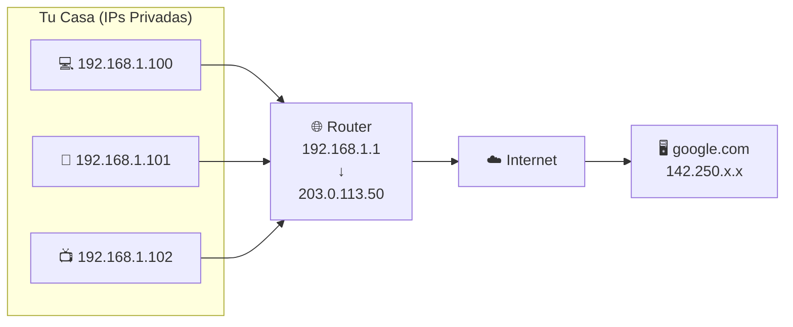

# Direcciones IP

Una **dirección IP** es como la dirección de una casa: identifica de forma única un dispositivo en una red para que los paquetes sepan a dónde ir.

## 🏠 Analogía

Piensa en internet como una ciudad enorme:

- **Dirección IP** = Dirección de la casa (Calle Mayor 123)
- **Puerto** = Número de apartamento (Apt. 4B)
- **Router** = Oficina de correos del barrio

## 📊 IPv4 vs IPv6

### IPv4 (La más común)

Formato: **4 números del 0-255 separados por puntos**

```
192.168.1.100
│   │   │  │
│   │   │  └─ Host (tu dispositivo)
│   │   └──── Subred
│   └──────── Red
└──────────── Clase
```

**Ejemplos:**
- `192.168.1.1` - Router típico de casa
- `8.8.8.8` - DNS de Google
- `127.0.0.1` - Tu propia máquina (localhost)

### IPv6 (El futuro)

Formato: **8 grupos de 4 caracteres hexadecimales**

```
2001:0db8:85a3:0000:0000:8a2e:0370:7334
```

Se puede abreviar:
```
2001:db8:85a3::8a2e:370:7334
```

!!! info "¿Por qué IPv6?"
    IPv4 solo permite ~4.3 mil millones de direcciones.
    Con tantos dispositivos conectados, ¡ya no alcanzan!
    IPv6 permite 340 sextillones (340 × 10³⁶).

## 🏷️ Tipos de Direcciones IP

### Públicas vs Privadas

| Tipo | Visible en Internet | Uso | Ejemplo |
|------|--------------------:|-----|---------|
| **Pública** | ✅ Sí | Servidores, routers | 203.0.113.50 |
| **Privada** | ❌ No | Red local | 192.168.1.100 |

### Rangos de IPs Privadas

```
┌─────────────────────────────────────────────────┐
│ Clase A: 10.0.0.0 - 10.255.255.255             │
│ (16 millones de direcciones)                    │
├─────────────────────────────────────────────────┤
│ Clase B: 172.16.0.0 - 172.31.255.255           │
│ (1 millón de direcciones)                       │
├─────────────────────────────────────────────────┤
│ Clase C: 192.168.0.0 - 192.168.255.255         │
│ (65 mil direcciones) ← Tu red de casa          │
└─────────────────────────────────────────────────┘
```

### Direcciones Especiales

| Dirección | Nombre | Uso |
|-----------|--------|-----|
| `127.0.0.1` | Localhost | Tu propia máquina |
| `0.0.0.0` | Todas las interfaces | Escuchar en todo |
| `255.255.255.255` | Broadcast | Enviar a todos |
| `169.254.x.x` | Link-local | Sin DHCP disponible |

## 🔄 Cómo Funciona (NAT)

Tu red de casa usa **NAT** (Network Address Translation):



**El proceso:**

1. Tu PC (192.168.1.100) envía paquete a Google
2. El router traduce: cambia 192.168.1.100 → 203.0.113.50
3. Google responde a 203.0.113.50
4. El router traduce de vuelta: 203.0.113.50 → 192.168.1.100
5. Tu PC recibe la respuesta

## 📊 En LeirEye

Cuando capturas tráfico, verás dos tipos de IPs:

### Tráfico Local
```
192.168.1.100 → 192.168.1.1  (Tu PC → Router)
```

### Tráfico a Internet
```
192.168.1.100 → 8.8.8.8      (Tu PC → DNS Google)
192.168.1.100 → 142.250.x.x  (Tu PC → Google)
```

!!! tip "Identificar tu IP"
    ```bash
    # IP local
    ifconfig | grep "inet " | grep -v 127.0.0.1
    
    # IP pública
    curl ifconfig.me
    ```

## 🔍 Cómo Interpretar IPs en Capturas

| Rango de IP | Probablemente es... |
|-------------|---------------------|
| 192.168.x.x | Dispositivo en tu red |
| 10.x.x.x | Dispositivo en red corporativa |
| 172.16-31.x.x | Dispositivo en red privada |
| 8.8.8.8, 8.8.4.4 | DNS de Google |
| 1.1.1.1 | DNS de Cloudflare |
| 127.0.0.1 | Tu propia máquina |
| Cualquier otra | Servidor en internet |

## 🛠️ Herramientas Útiles

### Ver tu configuración IP
```bash
# macOS/Linux
ifconfig

# O más moderno
ip addr show
```

### Resolver IP de un dominio
```bash
nslookup google.com
# o
dig google.com
```

### Ver ruta a un destino
```bash
traceroute google.com
```

## 🔒 Consideraciones de Seguridad

!!! warning "Geolocalización"
    Las IPs públicas pueden revelar tu ubicación aproximada.
    Por eso existen VPNs y Tor.

!!! warning "IPs Sospechosas"
    En LeirEye, presta atención a:
    
    - IPs que no reconoces comunicándose con tu PC
    - Muchas conexiones a una misma IP desconocida
    - IPs de países inesperados

### Verificar una IP

```bash
# Información sobre una IP
whois 8.8.8.8

# Geolocalización aproximada
curl ipinfo.io/8.8.8.8
```

## 💡 Práctica en LeirEye

1. **Captura tráfico** por 1 minuto
2. **Identifica** qué IPs son locales vs públicas
3. **Investiga** una IP desconocida con `whois`
4. **Usa el mapa de red** para visualizar conexiones

## 📚 Siguiente Paso

- [Puertos](ports.md) - La otra parte de una dirección de red
- [TCP vs UDP](tcp-vs-udp.md) - Cómo viajan los datos
