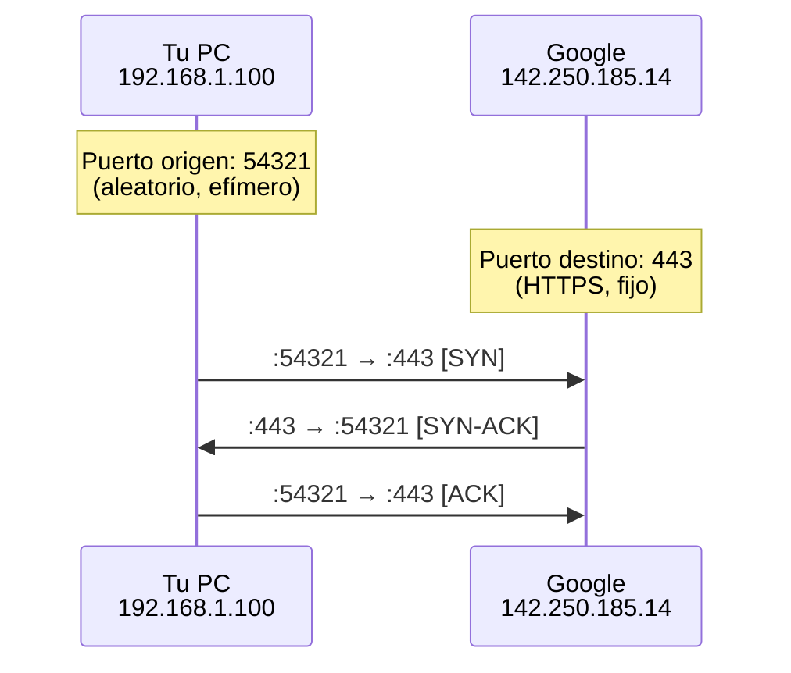

# Puertos de Red

Un **puerto** es un número que identifica una aplicación o servicio específico en un dispositivo. Si la dirección IP es la dirección de un edificio, el puerto es el número de apartamento.

## 🚪 Analogía

Imagina un edificio de oficinas:

- **Dirección del edificio** = Dirección IP (192.168.1.100)
- **Oficina 80** = Puerto 80 (Servidor Web)
- **Oficina 22** = Puerto 22 (SSH)
- **Oficina 443** = Puerto 443 (HTTPS)

Cuando envías un paquete, necesitas saber:
1. ¿A qué edificio va? → IP
2. ¿A qué oficina? → Puerto

## 📊 Formato Completo

Una conexión se identifica por 5 valores:

```
192.168.1.100:54321 → 142.250.185.14:443
      │        │              │        │
      │        │              │        └─ Puerto destino (HTTPS)
      │        │              └────────── IP destino (Google)
      │        └───────────────────────── Puerto origen (aleatorio)
      └────────────────────────────────── IP origen (tu PC)
```

## 🎯 Rangos de Puertos

| Rango | Nombre | Uso |
|-------|--------|-----|
| 0-1023 | **Well-Known** | Servicios estándar (requiere root) |
| 1024-49151 | **Registered** | Aplicaciones registradas |
| 49152-65535 | **Dynamic** | Puertos temporales (efímeros) |

### Puertos Well-Known (0-1023)

| Puerto | Servicio | Descripción |
|--------|----------|-------------|
| 20, 21 | FTP | Transferencia de archivos |
| 22 | SSH | Acceso remoto seguro |
| 23 | Telnet | Acceso remoto (inseguro) |
| 25 | SMTP | Envío de correo |
| 53 | DNS | Resolución de nombres |
| 67, 68 | DHCP | Asignación de IPs |
| 80 | HTTP | Páginas web |
| 110 | POP3 | Recibir correo |
| 143 | IMAP | Correo (mantiene en servidor) |
| 443 | HTTPS | Páginas web seguras |
| 993 | IMAPS | IMAP seguro |
| 995 | POP3S | POP3 seguro |

### Puertos Registrados Comunes

| Puerto | Servicio | Descripción |
|--------|----------|-------------|
| 1433 | MSSQL | Base de datos Microsoft |
| 3306 | MySQL | Base de datos MySQL |
| 3389 | RDP | Escritorio remoto Windows |
| 5432 | PostgreSQL | Base de datos PostgreSQL |
| 5900 | VNC | Escritorio remoto |
| 6379 | Redis | Cache/Base de datos |
| 8080 | HTTP Alt | Servidor web alternativo |
| 8443 | HTTPS Alt | HTTPS alternativo |
| 27017 | MongoDB | Base de datos MongoDB |

## 🔄 Puerto Origen vs Destino



**Puerto Origen**: 
- Elegido automáticamente por tu sistema operativo
- Rango 49152-65535 (efímero)
- Diferente para cada conexión

**Puerto Destino**:
- Fijo, determina el servicio
- Puerto 443 = siempre HTTPS
- Puerto 80 = siempre HTTP

## 📊 En LeirEye

En la captura verás algo como:

```
#   Origen              Destino             Proto  Info
1   192.168.1.100:54321 8.8.8.8:53          UDP    DNS Query
2   192.168.1.100:54322 142.250.185.14:443  TCP    HTTPS
3   192.168.1.100:54323 151.101.1.140:443   TCP    HTTPS (Reddit)
```

### Interpretar Puertos

| Puerto Destino | Significa |
|----------------|-----------|
| :53 | Consulta DNS |
| :80 | Navegación HTTP (sin cifrar) |
| :443 | Navegación HTTPS (cifrada) |
| :22 | Conexión SSH |
| :3306 | Conexión a MySQL |

## 🔍 Ver Puertos en Uso

### En tu sistema

```bash
# macOS/Linux: Ver puertos en escucha
netstat -an | grep LISTEN

# O más moderno
lsof -i -P | grep LISTEN

# Ver qué proceso usa un puerto
lsof -i :8000
```

### Ejemplo de salida

```
COMMAND   PID   USER   FD   TYPE  DEVICE  NAME
python    1234  user   5u   IPv4  0x1234  *:8000 (LISTEN)
node      5678  user   12u  IPv4  0x5678  *:3001 (LISTEN)
postgres  9012  user   8u   IPv4  0x9012  *:5432 (LISTEN)
```

## ⚠️ Puertos Sospechosos

Algunos puertos merecen atención especial:

| Puerto | Por qué es sospechoso |
|--------|----------------------|
| 4444 | Default de Metasploit |
| 5555 | ADB (Android Debug) expuesto |
| 6666, 6667 | IRC (usado por botnets) |
| 31337 | "Elite" - backdoors clásicos |
| 1337 | "Leet" - otro puerto de hackers |

!!! warning "En LeirEye"
    Si ves tráfico significativo a estos puertos,
    investiga qué proceso lo está generando:
    ```bash
    lsof -i :4444
    ```

## 🔒 Seguridad de Puertos

### Firewall

Controla qué puertos están abiertos:

```bash
# macOS: Ver reglas de firewall
sudo pfctl -s rules

# Linux: Ver reglas de iptables
sudo iptables -L

# Bloquear un puerto
sudo iptables -A INPUT -p tcp --dport 4444 -j DROP
```

### Escaneo de Puertos

Para ver qué puertos tiene abiertos un host:

```bash
# Escaneo básico con nmap
nmap 192.168.1.1

# Escaneo de puertos comunes
nmap -F 192.168.1.1

# Escaneo completo (tarda más)
nmap -p- 192.168.1.1
```

## 💡 Práctica en LeirEye

1. **Captura tráfico** mientras navegas
2. **Filtra** por puerto 443 (HTTPS)
3. **Observa** cuántas conexiones diferentes hay
4. **Compara** con puerto 80 (HTTP) - debería haber menos

### Experimento

```bash
# En una terminal
python -m http.server 8000

# En el navegador
# Abre http://localhost:8000

# En LeirEye
# Captura en interfaz lo0 (loopback)
# Verás tráfico al puerto 8000
```

## 📚 Siguiente Paso

- [TCP vs UDP](tcp-vs-udp.md) - Cómo se transmiten los datos
- [Protocolos](../protocols/index.md) - HTTP, DNS, SSH y más
