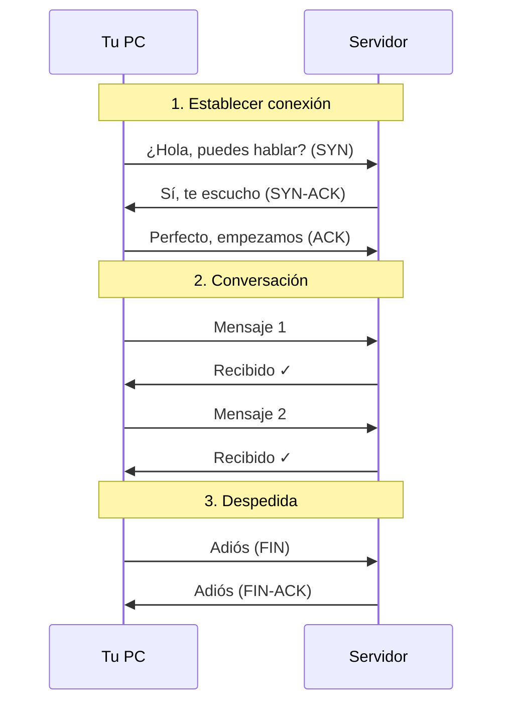
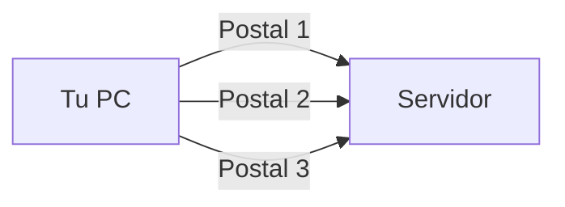

# TCP vs UDP

TCP y UDP son los dos protocolos principales de **capa de transporte**. Determinan cómo se envían los datos entre aplicaciones.

## ⚡ Resumen Rápido

| Característica | TCP | UDP |
|----------------|-----|-----|
| **Conexión** | Orientado a conexión | Sin conexión |
| **Fiabilidad** | Garantiza entrega | No garantiza |
| **Orden** | Mantiene orden | Puede desordenarse |
| **Velocidad** | Más lento | Más rápido |
| **Uso típico** | Web, email, archivos | Video, gaming, DNS |

## 📞 Analogía: Teléfono vs Correo Postal

### TCP = Llamada Telefónica



- ✅ Sabes que el otro está escuchando
- ✅ Confirmas que cada mensaje llegó
- ✅ Conversación ordenada
- ❌ Toma tiempo establecer la llamada

### UDP = Enviar Postales



- ✅ Rápido, solo envías
- ✅ Sin esperar confirmación
- ❌ No sabes si llegó
- ❌ Pueden llegar desordenadas

## 🔍 TCP en Detalle

### El Three-Way Handshake

Antes de enviar datos, TCP establece una conexión:

```
Cliente                    Servidor
   │                          │
   │──── SYN (seq=100) ──────>│  "Quiero conectar"
   │                          │
   │<── SYN-ACK (seq=300, ────│  "OK, conectemos"
   │         ack=101)         │
   │                          │
   │──── ACK (ack=301) ──────>│  "Perfecto"
   │                          │
   │     CONEXIÓN ESTABLECIDA │
```

### Flags TCP

En LeirEye verás estos flags:

| Flag | Nombre | Significado |
|------|--------|-------------|
| SYN | Synchronize | "Quiero iniciar conexión" |
| ACK | Acknowledge | "Recibí tu mensaje" |
| FIN | Finish | "Quiero cerrar conexión" |
| RST | Reset | "Abortar conexión" |
| PSH | Push | "Procesa estos datos ya" |
| URG | Urgent | "Datos urgentes" |

### Ejemplo en LeirEye

```
#   Tiempo   Origen→Destino              Flags    Info
1   0.000    192.168.1.100→142.250.x.x   [SYN]    Seq=0
2   0.025    142.250.x.x→192.168.1.100   [SYN,ACK] Seq=0 Ack=1
3   0.026    192.168.1.100→142.250.x.x   [ACK]    Seq=1 Ack=1
4   0.027    192.168.1.100→142.250.x.x   [PSH,ACK] HTTP GET /
5   0.052    142.250.x.x→192.168.1.100   [ACK]    Ack=...
6   0.053    142.250.x.x→192.168.1.100   [PSH,ACK] HTTP 200 OK
```

### Retransmisión

Si un paquete se pierde, TCP lo reenvía:

```
Cliente                    Servidor
   │                          │
   │──── Paquete 1 ──────────>│ ✓ Llegó
   │<──── ACK 1 ──────────────│
   │                          │
   │──── Paquete 2 ────X      │ ✗ Perdido
   │                          │
   │     (espera timeout)     │
   │                          │
   │──── Paquete 2 ──────────>│ ✓ Reintento
   │<──── ACK 2 ──────────────│
```

## 🚀 UDP en Detalle

### Sin Handshake

UDP simplemente envía:

```
Cliente                    Servidor
   │                          │
   │──── Datos 1 ────────────>│
   │──── Datos 2 ────────────>│
   │──── Datos 3 ────────────>│
   │                          │
   │  (sin confirmación)      │
```

### Estructura Simple

```
┌─────────────────────────────────────┐
│ Puerto Origen  │  Puerto Destino   │
├─────────────────────────────────────┤
│    Longitud    │    Checksum       │
├─────────────────────────────────────┤
│              DATOS                  │
└─────────────────────────────────────┘
```

Solo 8 bytes de cabecera (TCP tiene 20-60 bytes).

### Ejemplo en LeirEye

```
#   Tiempo   Origen→Destino         Proto  Info
1   0.000    192.168.1.100→8.8.8.8  UDP    DNS Query: google.com
2   0.025    8.8.8.8→192.168.1.100  UDP    DNS Response: 142.250.x.x
```

## 🎯 Cuándo Usar Cada Uno

### TCP es mejor para:

| Aplicación | Por qué TCP |
|------------|-------------|
| 🌐 Navegación web | Páginas deben llegar completas |
| 📧 Email | Mensajes no pueden perderse |
| 📁 Transferencia de archivos | Archivos deben estar íntegros |
| 🔐 SSH | Comandos deben ejecutarse en orden |
| 💳 Transacciones | Datos financieros críticos |

### UDP es mejor para:

| Aplicación | Por qué UDP |
|------------|-------------|
| 🎮 Gaming online | Latencia baja más importante que perder un frame |
| 📹 Video streaming | Mejor saltarse un frame que pausar |
| 📞 VoIP/Videollamadas | Audio en tiempo real |
| 🔍 DNS | Consultas rápidas y pequeñas |
| 📡 Streaming en vivo | Tiempo real prioritario |

## 📊 Comparación Visual

```
         TCP                           UDP
┌─────────────────────┐    ┌─────────────────────┐
│ ☑ Conexión         │    │ ☐ Sin conexión      │
│ ☑ ACKs             │    │ ☐ Sin confirmación  │
│ ☑ Orden garantizado│    │ ☐ Puede desordenar  │
│ ☑ Control de flujo │    │ ☐ Sin control       │
│ ☐ Más overhead     │    │ ☑ Mínimo overhead   │
│ ☐ Más lento        │    │ ☑ Más rápido        │
└─────────────────────┘    └─────────────────────┘
```

## 🛡️ Consideraciones de Seguridad

### TCP

- **SYN Flood**: Atacante envía muchos SYN sin completar handshake
- **RST Attack**: Atacante envía RST para cortar conexiones
- **Más auditable**: Conexiones establecidas dejan rastro

### UDP

- **Spoofing fácil**: Sin conexión, fácil falsificar origen
- **Amplificación DNS**: Pequeña consulta = gran respuesta
- **Difícil de trackear**: No hay estado de conexión

## 💡 Práctica en LeirEye

### Experimento 1: Ver TCP Handshake

1. **Inicia captura**
2. **Abre** una página web nueva
3. **Busca** paquetes con flag `[SYN]`
4. **Observa** la secuencia SYN → SYN-ACK → ACK

### Experimento 2: Ver UDP

1. **Inicia captura**
2. **Ejecuta**: `nslookup google.com`
3. **Busca** paquetes UDP al puerto 53
4. **Observa**: solo Query y Response, sin handshake

### Experimento 3: Comparar

```bash
# Streaming (UDP)
# Abre YouTube y observa el tráfico

# Descarga (TCP)
curl -O https://example.com/file.zip
```

## 📚 Siguiente Paso

Ahora que entiendes cómo viajan los datos, aprende sobre los protocolos específicos:

- [DNS](../protocols/dns.md) - Usa UDP (mayormente)
- [HTTP/HTTPS](../protocols/http-https.md) - Usa TCP
- [SSH](../protocols/ssh.md) - Usa TCP
