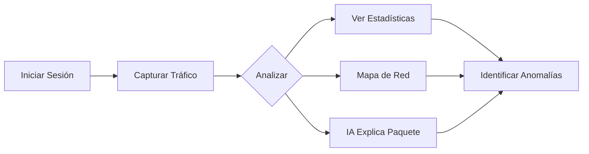

# Guía de Uso

LeirEye ofrece múltiples herramientas para el análisis de redes. Esta sección explica cómo usar cada una.

## 🎛️ Panel Principal

<div class="grid cards" markdown>

-   :material-radar:{ .lg .middle } **Captura de Paquetes**

    ---

    Captura tráfico de red en tiempo real con análisis detallado

    [:octicons-arrow-right-24: Ver guía](packet-capture.md)

-   :material-chart-bar:{ .lg .middle } **Estadísticas**

    ---

    Visualiza estadísticas y gráficos del tráfico de red

    [:octicons-arrow-right-24: Ver guía](statistics.md)

-   :material-sitemap:{ .lg .middle } **Mapa de Red**

    ---

    Visualización interactiva de la topología de red

    [:octicons-arrow-right-24: Ver guía](network-map.md)

-   :material-robot:{ .lg .middle } **Explicador IA**

    ---

    Análisis inteligente de paquetes con Ollama

    [:octicons-arrow-right-24: Ver guía](ai-explainer.md)

-   :material-information:{ .lg .middle } **Sistema**

    ---

    Información del sistema y configuración

    [:octicons-arrow-right-24: Ver guía](system-info.md)

</div>

## 🧭 Navegación

La interfaz de LeirEye usa una **barra lateral profesional** con:

- **Logo** y nombre del proyecto arriba
- **Secciones principales** con iconos descriptivos
- **Tarjeta de usuario** abajo mostrando rol y nombre

### Roles de Usuario

| Rol | Permisos |
|-----|----------|
| **ADMIN** | Acceso total, gestión de usuarios |
| **ANALYST** | Captura y análisis, sin gestión |
| **VIEWER** | Solo lectura de datos |

## 🔄 Flujo de Trabajo Típico



## 💡 Tips Rápidos

!!! tip "Captura Eficiente"
    Usa filtros de interfaz para capturar solo el tráfico relevante.
    Por ejemplo, `en0` para WiFi en macOS.

!!! tip "Análisis IA"
    Selecciona paquetes sospechosos y usa el explicador IA para entender qué hacen.

!!! tip "Permisos Root"
    La captura requiere permisos elevados:
    ```bash
    sudo python run.py
    ```
