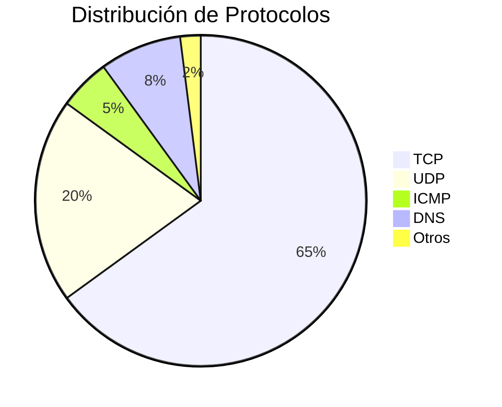

# Estadísticas de Red

El módulo de estadísticas te permite visualizar y analizar patrones en el tráfico de red capturado.

## 📊 Vista General

El panel de estadísticas muestra:

- **Gráficos en tiempo real** del tráfico
- **Distribución por protocolo**
- **Top IPs** más activas
- **Tendencias** temporales

## 📈 Tipos de Estadísticas

### Distribución por Protocolo

Gráfico circular mostrando qué protocolos dominan tu red:



**Interpretación:**
- TCP dominante → Navegación web, apps normales ✅
- UDP alto → Streaming, gaming, VoIP
- ICMP inusual → Posible escaneo o ping flood ⚠️

### Tráfico por Tiempo

Gráfico de línea mostrando paquetes/segundo:

```
       Paquetes/seg
   100 │     ╭─╮
    75 │    ╭╯ ╰╮   ╭─╮
    50 │──╮╭╯   ╰───╯ ╰──
    25 │  ╰╯
     0 └──────────────────
       10:00  10:05  10:10
```

**Interpretación:**
- Picos → Actividad intensa (descargas, streaming)
- Línea plana alta → Transferencia continua
- Picos repentinos → Posible anomalía

### Top Direcciones IP

Tabla de las IPs más activas:

| Ranking | IP | Paquetes | % Total | Tipo |
|---------|-----|----------|---------|------|
| 1 | 192.168.1.1 | 1,234 | 25% | Gateway |
| 2 | 8.8.8.8 | 567 | 11% | DNS Google |
| 3 | 142.250.x.x | 456 | 9% | Google |
| 4 | 192.168.1.100 | 321 | 6% | Tu PC |

### Top Puertos

Puertos más utilizados:

| Puerto | Servicio | Paquetes | Estado |
|--------|----------|----------|--------|
| 443 | HTTPS | 2,345 | ✅ Normal |
| 80 | HTTP | 456 | ✅ Normal |
| 53 | DNS | 234 | ✅ Normal |
| 22 | SSH | 12 | ✅ Normal |
| 4444 | ??? | 89 | ⚠️ Revisar |

!!! warning "Puertos Sospechosos"
    Tráfico significativo en puertos no estándar puede indicar:
    
    - Malware usando puertos inusuales
    - Servicios mal configurados
    - Tunneling o C2 (Command & Control)

## 🎯 Casos de Uso

### Detectar Consumo Anómalo

1. Revisa **Top IPs** por volumen
2. ¿Alguna IP interna envía mucho tráfico?
3. ¿Hay conexiones a IPs desconocidas?

### Identificar Servicios Activos

1. Revisa **Top Puertos**
2. ¿Hay servicios inesperados?
3. Ejemplo: Puerto 3389 (RDP) abierto sin razón

### Monitorear Rendimiento

1. Observa **Tráfico por Tiempo**
2. ¿Hay saturación en horarios específicos?
3. ¿Patrones regulares indican backups automáticos?

## 📊 Exportar Datos

Puedes exportar las estadísticas en varios formatos:

- **JSON**: Para procesamiento programático
- **CSV**: Para Excel/hojas de cálculo
- **PDF**: Para reportes

```bash
# Vía API
curl http://localhost:8000/api/stats/export?format=json \
  -H "Authorization: Bearer $TOKEN" \
  > estadisticas.json
```

## 🔧 Filtros Avanzados

### Por Rango de Tiempo

Selecciona un período específico:
- Última hora
- Últimas 24 horas
- Última semana
- Rango personalizado

### Por Protocolo

Filtra estadísticas solo para:
- TCP
- UDP
- HTTP/HTTPS
- DNS

### Por Dirección

- Solo tráfico entrante
- Solo tráfico saliente
- Ambas direcciones

## 💡 Tips

!!! tip "Baseline Normal"
    Captura estadísticas durante operación normal.
    Úsalas como referencia para detectar anomalías.

!!! tip "Automatización"
    Configura alertas cuando las estadísticas excedan umbrales.
    Por ejemplo: más de 1000 paquetes/seg a un puerto inusual.

!!! tip "Correlación"
    Combina estadísticas con el mapa de red para visualizar
    qué conexiones generan más tráfico.
