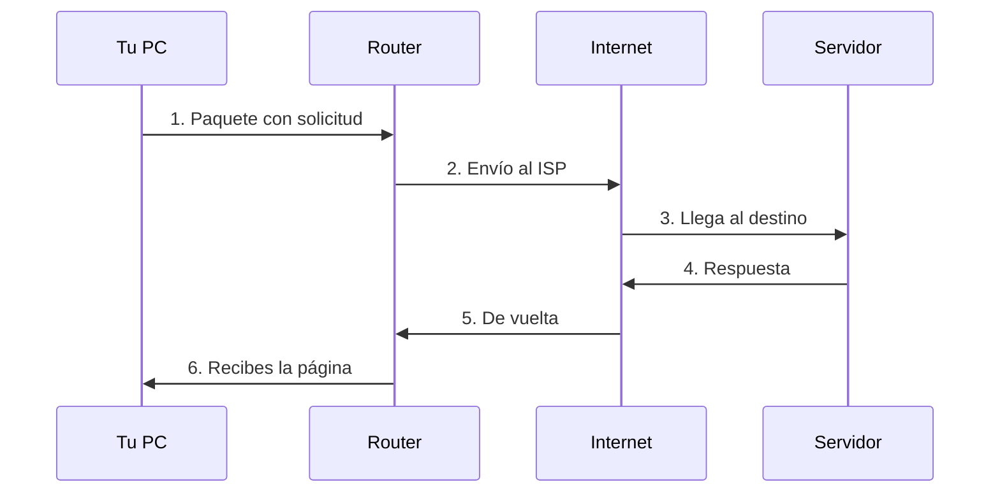

# Fundamentos de Redes

Esta sección cubre los conceptos básicos que necesitas entender para usar NetMentor efectivamente.

## 📚 Contenido

<div class="grid cards" markdown>

-   :material-package-variant:{ .lg .middle } **¿Qué es un Paquete?**

    ---

    Entiende la unidad básica de comunicación en redes

    [:octicons-arrow-right-24: Leer](what-is-a-packet.md)

-   :material-ip:{ .lg .middle } **Direcciones IP**

    ---

    Cómo se identifican los dispositivos en la red

    [:octicons-arrow-right-24: Leer](ip-addresses.md)

-   :material-door:{ .lg .middle } **Puertos**

    ---

    Las "puertas" que usan las aplicaciones

    [:octicons-arrow-right-24: Leer](ports.md)

-   :material-compare:{ .lg .middle } **TCP vs UDP**

    ---

    Los dos protocolos de transporte principales

    [:octicons-arrow-right-24: Leer](tcp-vs-udp.md)

</div>

## 🎯 Objetivos de Aprendizaje

Después de esta sección podrás:

- [x] Explicar qué es un paquete de red
- [x] Entender cómo funcionan las direcciones IP
- [x] Identificar puertos y sus usos comunes
- [x] Diferenciar entre TCP y UDP
- [x] Interpretar la información básica en NetMentor

## 🔄 Flujo de Datos

Cuando navegas a un sitio web, esto es lo que pasa:



Cada flecha representa uno o más **paquetes** viajando por la red.

## 📊 ¿Qué Verás en NetMentor?

Cuando captures tráfico, cada fila representa un paquete:

```
#   Tiempo     Origen          Destino         Protocolo  Info
1   0.000000   192.168.1.100   8.8.8.8         DNS        Query: google.com
2   0.025432   8.8.8.8         192.168.1.100   DNS        Response: 142.250.x.x
3   0.030123   192.168.1.100   142.250.x.x     TCP        SYN
4   0.055678   142.250.x.x     192.168.1.100   TCP        SYN-ACK
5   0.056012   192.168.1.100   142.250.x.x     TCP        ACK
6   0.060345   192.168.1.100   142.250.x.x     HTTP       GET /
```

**¿Qué significan estas columnas?**

| Columna | Concepto | Aprende Más |
|---------|----------|-------------|
| Origen/Destino | Direcciones IP | [IP Addresses](ip-addresses.md) |
| Protocolo | TCP, UDP, DNS... | [TCP vs UDP](tcp-vs-udp.md) |
| Info | Puertos, flags | [Puertos](ports.md) |

## 💡 Analogía del Correo

Piensa en la red como el sistema postal:

| Concepto de Red | Analogía Postal |
|-----------------|-----------------|
| **Paquete** | Carta o paquete |
| **Dirección IP** | Dirección de la casa |
| **Puerto** | Número de apartamento |
| **Protocolo** | Tipo de envío (urgente, certificado) |
| **Router** | Oficina de correos |

```
┌─────────────────────────────────────┐
│         📦 PAQUETE DE RED           │
├─────────────────────────────────────┤
│ De: 192.168.1.100:54321            │  ← Tu IP:Puerto
│ Para: 8.8.8.8:53                   │  ← Destino:Puerto
│ Tipo: UDP (no requiere firma)       │  ← Protocolo
├─────────────────────────────────────┤
│ Contenido:                          │
│ "¿Cuál es la IP de google.com?"    │  ← Datos
└─────────────────────────────────────┘
```

## ⚡ Empieza Aquí

Te recomiendo seguir este orden:

1. **[¿Qué es un Paquete?](what-is-a-packet.md)** - El concepto más fundamental
2. **[Direcciones IP](ip-addresses.md)** - Cómo se identifican los dispositivos
3. **[Puertos](ports.md)** - Cómo las apps se comunican
4. **[TCP vs UDP](tcp-vs-udp.md)** - Los dos tipos de envío

¡Después estarás listo para entender los [Protocolos](../protocols/index.md)!
