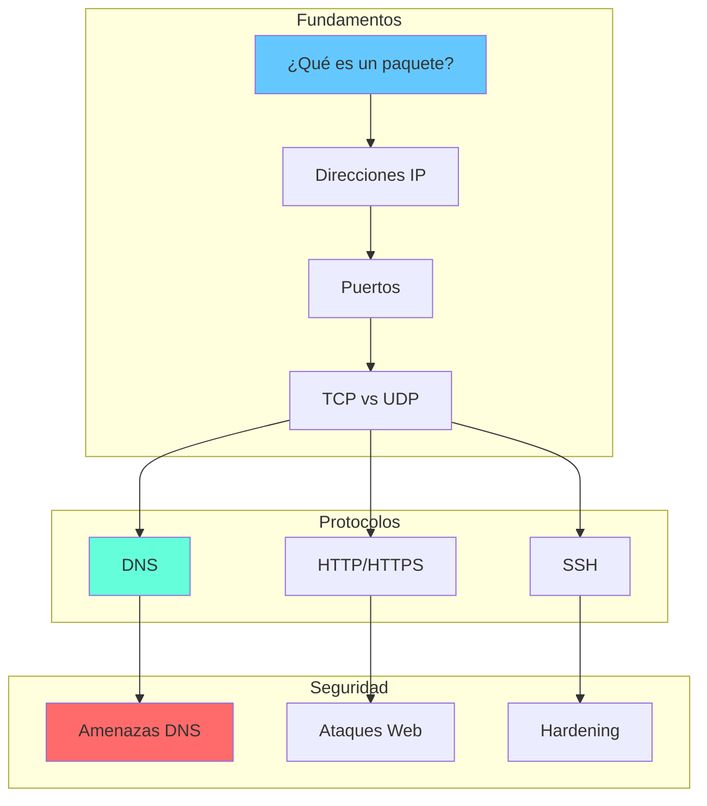

# 📚 Aprende Redes con LeirEye

Bienvenido a la sección educativa de LeirEye. Aquí aprenderás los conceptos fundamentales de redes y seguridad que te permitirán entender lo que ves en la herramienta.

## 🎯 ¿Por Qué Aprender Esto?

Entender redes te permite:

- 🔍 **Diagnosticar** problemas de conectividad
- 🛡️ **Proteger** tu red de amenazas
- 🚀 **Optimizar** el rendimiento
- 💼 **Desarrollar** habilidades profesionales

## 📖 Contenido

<div class="grid cards" markdown>

-   :material-package-variant:{ .lg .middle } **Fundamentos**

    ---

    Conceptos básicos de redes: paquetes, direcciones, puertos

    [:octicons-arrow-right-24: Empezar](basics/index.md)

-   :material-protocol:{ .lg .middle } **Protocolos**

    ---

    HTTP, DNS, SSH y otros protocolos que verás en LeirEye

    [:octicons-arrow-right-24: Explorar](protocols/index.md)

-   :material-shield-check:{ .lg .middle } **Seguridad**

    ---

    Amenazas comunes y cómo detectarlas

    [:octicons-arrow-right-24: Aprender](security/index.md)

</div>

## 🗺️ Mapa de Aprendizaje



## 🎓 Rutas de Aprendizaje

### 👶 Principiante (2-3 horas)

1. [¿Qué es un paquete?](basics/what-is-a-packet.md)
2. [Direcciones IP explicadas](basics/ip-addresses.md)
3. [Puertos: las puertas de tu computadora](basics/ports.md)
4. [Tu primera captura con LeirEye](../guide/packet-capture.md)

### 🧑‍💻 Intermedio (4-5 horas)

1. [TCP vs UDP: ¿cuál usar?](basics/tcp-vs-udp.md)
2. [DNS: el directorio de internet](protocols/dns.md)
3. [HTTP y HTTPS: navegación web](protocols/http-https.md)
4. [Analizando tu tráfico web](../guide/statistics.md)

### 🔒 Seguridad (3-4 horas)

1. [Fundamentos de seguridad en redes](security/basics.md)
2. [Detectando tráfico sospechoso](security/suspicious-traffic.md)
3. [Mejores prácticas](security/best-practices.md)
4. [Usando IA para análisis](../guide/ai-explainer.md)

## 📊 El Modelo OSI Simplificado

LeirEye trabaja principalmente con las capas 3-7:

| Capa | Nombre | Qué Ves en LeirEye |
|------|--------|---------------------|
| 7 | Aplicación | HTTP, DNS, datos |
| 4 | Transporte | TCP, UDP, puertos |
| 3 | Red | Direcciones IP |
| 2 | Enlace | Direcciones MAC |

```
┌─────────────────────────────────────────┐
│  Capa 7: Aplicación (HTTP, DNS, SSH)    │  ← Datos de apps
├─────────────────────────────────────────┤
│  Capa 4: Transporte (TCP, UDP)          │  ← Puertos
├─────────────────────────────────────────┤
│  Capa 3: Red (IP)                       │  ← Direcciones IP
├─────────────────────────────────────────┤
│  Capa 2: Enlace (Ethernet)              │  ← Direcciones MAC
└─────────────────────────────────────────┘
```

## 💡 Tips de Aprendizaje

!!! tip "Aprende Haciendo"
    La mejor forma de entender redes es **experimentando**:
    
    1. Captura tu propio tráfico
    2. Identifica patrones
    3. Usa el explicador IA cuando tengas dudas

!!! tip "No Memorices, Entiende"
    Los detalles técnicos cambiarán, pero los conceptos permanecen.
    Enfócate en **por qué** funcionan las cosas, no solo **cómo**.

!!! tip "Practica con Escenarios Reales"
    - Abre YouTube y captura el tráfico
    - Envía un email y observa los paquetes
    - Visita un sitio web y analiza las conexiones

## 🔗 Recursos Externos

Para profundizar más:

- 📖 [RFC Editor](https://www.rfc-editor.org/) - Especificaciones oficiales
- 🎓 [Cisco Networking Academy](https://www.netacad.com/) - Cursos formales
- 📺 [NetworkChuck](https://www.youtube.com/c/NetworkChuck) - Tutoriales en video
- 🛠️ [Wireshark Docs](https://www.wireshark.org/docs/) - Análisis avanzado
