# DNS - Domain Name System

**DNS** es el "directorio telefónico" de internet. Traduce nombres legibles como `google.com` a direcciones IP como `142.250.185.14`.

## 🎯 ¿Por Qué Existe DNS?

Los humanos recordamos nombres, las computadoras usan números:

| Lo que escribes | Lo que necesita la red |
|-----------------|------------------------|
| google.com | 142.250.185.14 |
| github.com | 140.82.121.4 |
| netflix.com | 54.246.226.55 |

DNS hace la traducción automáticamente.

## 🔄 Cómo Funciona

```mermaid
sequenceDiagram
    participant PC as 💻 Tu PC
    participant Cache as 📦 Cache Local
    participant Router as 🌐 Router
    participant ISP as 🏢 DNS ISP
    participant Root as 🌍 Root DNS
    participant TLD as 📁 .com DNS
    participant Auth as 🎯 google.com DNS

    PC->>Cache: 1. ¿IP de google.com?
    Cache-->>PC: ❌ No la tengo
    
    PC->>Router: 2. ¿IP de google.com?
    Router-->>PC: ❌ No la tengo
    
    Router->>ISP: 3. ¿IP de google.com?
    ISP-->>Router: ❌ Voy a buscar
    
    ISP->>Root: 4. ¿Quién maneja .com?
    Root->>ISP: 5. Pregunta a estos servidores TLD
    
    ISP->>TLD: 6. ¿Quién maneja google.com?
    TLD->>ISP: 7. Pregunta a ns1.google.com
    
    ISP->>Auth: 8. ¿IP de google.com?
    Auth->>ISP: 9. Es 142.250.185.14
    
    ISP->>Router: 10. Es 142.250.185.14 (guárdala)
    Router->>PC: 11. Es 142.250.185.14
    PC->>Cache: 12. Guardar en cache
```



## 📊 Tipos de Registros DNS

| Tipo | Nombre | Propósito | Ejemplo |
|------|--------|-----------|---------|
| **A** | Address | IPv4 del dominio | google.com → 142.250.185.14 |
| **AAAA** | IPv6 Address | IPv6 del dominio | google.com → 2607:f8b0:... |
| **CNAME** | Canonical Name | Alias a otro dominio | www.example.com → example.com |
| **MX** | Mail Exchange | Servidor de correo | example.com → mail.example.com |
| **TXT** | Text | Texto libre | Verificación SPF, DKIM |
| **NS** | Name Server | Servidores DNS autoritativos | google.com → ns1.google.com |
| **PTR** | Pointer | IP → nombre (inverso) | 8.8.8.8 → dns.google |

## 🔍 En LeirEye

### Consulta DNS (Query)

```
#1 | UDP | 192.168.1.100:54321 → 8.8.8.8:53
Info: Standard query A google.com
```

**Decodificado:**
- `UDP` - DNS usa UDP normalmente
- `8.8.8.8:53` - Servidor DNS de Google, puerto 53
- `A` - Buscando dirección IPv4
- `google.com` - El dominio a resolver

### Respuesta DNS (Response)

```
#2 | UDP | 8.8.8.8:53 → 192.168.1.100:54321  
Info: Standard query response A 142.250.185.14
```

**Decodificado:**
- Respuesta con la IP: `142.250.185.14`

## 🛠️ Herramientas de Diagnóstico

### nslookup

```bash
$ nslookup google.com
Server:    8.8.8.8
Address:   8.8.8.8#53

Non-authoritative answer:
Name:      google.com
Address:   142.250.185.14
```

### dig (más detallado)

```bash
$ dig google.com

;; ANSWER SECTION:
google.com.    299    IN    A    142.250.185.14

;; Query time: 25 msec
;; SERVER: 8.8.8.8#53
```

### Ver cache DNS

```bash
# macOS
sudo dscacheutil -cachedump

# Limpiar cache
sudo dscacheutil -flushcache

# Linux
sudo systemd-resolve --statistics
```

## 🛡️ Seguridad DNS

### Amenazas Comunes

| Ataque | Descripción | Señal en LeirEye |
|--------|-------------|-------------------|
| **DNS Spoofing** | Respuestas falsas | IPs inesperadas para dominios conocidos |
| **DNS Tunneling** | Exfiltrar datos vía DNS | Consultas TXT muy largas, subdominios extraños |
| **DNS Amplification** | DDoS usando DNS | Muchas respuestas grandes a tu IP |

### Señales de Alerta

!!! warning "En LeirEye busca:"
    - Consultas a dominios muy largos o aleatorios
    - Muchas consultas TXT
    - DNS a servidores no reconocidos
    - Respuestas con IPs en rangos sospechosos

### Ejemplo de DNS Tunneling

```
# Normal
google.com
facebook.com
github.com

# Sospechoso (posible tunneling)
aGVsbG8gd29ybGQ.malicious-site.com
base64encodeddata.evil.tk
long-random-subdomain-1234abcd.c2server.ru
```

## 🔒 DNS Seguro

### DNS over HTTPS (DoH)

- Puerto: 443 (como HTTPS normal)
- Cifrado: TLS
- Proveedores: Cloudflare (1.1.1.1), Google (8.8.8.8)

### DNS over TLS (DoT)

- Puerto: 853
- Cifrado: TLS
- Más fácil de bloquear que DoH

### DNSSEC

- Firma criptográfica de respuestas
- Previene spoofing
- No cifra, solo autentica

## 💡 Práctica en LeirEye

### Experimento 1: Capturar DNS

1. **Inicia captura**
2. **Abre terminal**:
   ```bash
   nslookup github.com
   ```
3. **Busca** paquetes UDP al puerto 53
4. **Analiza** la consulta y respuesta

### Experimento 2: Ver Cache

1. **Limpia cache**:
   ```bash
   sudo dscacheutil -flushcache  # macOS
   ```
2. **Captura** mientras visitas un sitio nuevo
3. **Visita** el mismo sitio de nuevo
4. **Compara** - segunda vez no debería haber DNS

### Experimento 3: Diferentes DNS

```bash
# Probar con DNS de Google
nslookup google.com 8.8.8.8

# Probar con DNS de Cloudflare
nslookup google.com 1.1.1.1

# Comparar tiempos
time nslookup google.com 8.8.8.8
time nslookup google.com 1.1.1.1
```

## 📚 Recursos Adicionales

- [How DNS Works](https://howdns.works/) - Cómic interactivo
- [RFC 1035](https://tools.ietf.org/html/rfc1035) - Especificación DNS
- [DNSViz](https://dnsviz.net/) - Visualizar cadena DNS
