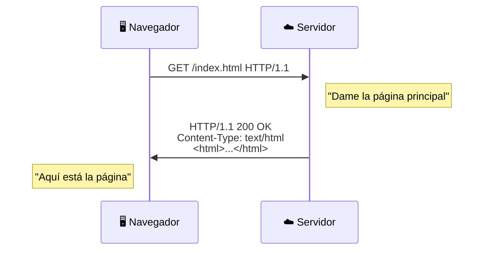
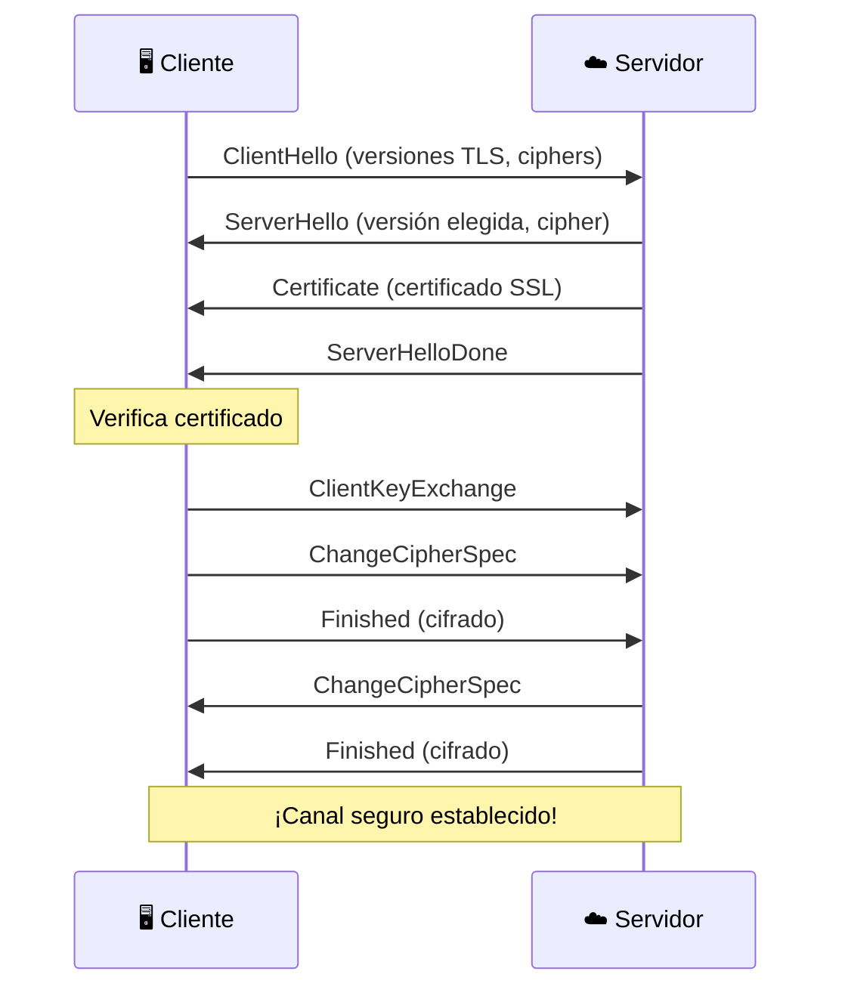

# HTTP y HTTPS

**HTTP** (HyperText Transfer Protocol) es el protocolo que hace funcionar la web. **HTTPS** es su versión segura con cifrado TLS.

## 🌐 Conceptos Básicos

### HTTP = Conversación Web



### Diferencia HTTP vs HTTPS

| Aspecto | HTTP | HTTPS |
|---------|------|-------|
| **Puerto** | 80 | 443 |
| **Cifrado** | ❌ No | ✅ Sí (TLS) |
| **Certificado** | ❌ No | ✅ Sí |
| **Seguridad** | ⚠️ Inseguro | ✅ Seguro |
| **En NetMentor** | Puedes ver datos | Solo ves "Application Data" |

## 📝 Métodos HTTP

| Método | Propósito | Ejemplo |
|--------|-----------|---------|
| **GET** | Obtener datos | Ver una página |
| **POST** | Enviar datos | Enviar formulario |
| **PUT** | Actualizar recurso | Editar perfil |
| **DELETE** | Eliminar recurso | Borrar cuenta |
| **HEAD** | Solo cabeceras | Verificar si existe |
| **OPTIONS** | Métodos permitidos | CORS preflight |

## 📊 Anatomía de una Petición

### Request (Petición)

```http
GET /api/users HTTP/1.1
Host: api.example.com
User-Agent: Mozilla/5.0 (Macintosh; ...)
Accept: application/json
Authorization: Bearer eyJhbGci...
Cookie: session=abc123
```

| Línea | Significado |
|-------|-------------|
| `GET /api/users` | Método y ruta |
| `Host:` | Dominio del servidor |
| `User-Agent:` | Tu navegador/aplicación |
| `Accept:` | Qué formato quieres |
| `Authorization:` | Tu credencial |
| `Cookie:` | Sesión guardada |

### Response (Respuesta)

```http
HTTP/1.1 200 OK
Content-Type: application/json
Content-Length: 1234
Set-Cookie: session=xyz789
Cache-Control: max-age=3600

{"users": [...]}
```

| Línea | Significado |
|-------|-------------|
| `200 OK` | Código de estado |
| `Content-Type:` | Tipo de datos |
| `Content-Length:` | Tamaño en bytes |
| `Set-Cookie:` | Nueva cookie |
| `Cache-Control:` | Cuánto tiempo cachear |

## 🔢 Códigos de Estado

### 2xx - Éxito ✅

| Código | Significado |
|--------|-------------|
| 200 | OK - Todo bien |
| 201 | Created - Recurso creado |
| 204 | No Content - OK pero sin cuerpo |

### 3xx - Redirección 🔄

| Código | Significado |
|--------|-------------|
| 301 | Moved Permanently - URL cambió |
| 302 | Found - Redirección temporal |
| 304 | Not Modified - Usa cache |

### 4xx - Error del Cliente ⚠️

| Código | Significado |
|--------|-------------|
| 400 | Bad Request - Petición malformada |
| 401 | Unauthorized - Necesita autenticación |
| 403 | Forbidden - No tienes permiso |
| 404 | Not Found - No existe |
| 429 | Too Many Requests - Rate limiting |

### 5xx - Error del Servidor ❌

| Código | Significado |
|--------|-------------|
| 500 | Internal Server Error - Error genérico |
| 502 | Bad Gateway - Proxy/servidor caído |
| 503 | Service Unavailable - Sobrecargado |

## 🔒 HTTPS y TLS

### El Handshake TLS



### Qué Protege HTTPS

- ✅ **Confidencialidad**: Datos cifrados
- ✅ **Integridad**: No se pueden modificar
- ✅ **Autenticación**: Verificas que es el servidor real

### Qué NO Protege

- ❌ **Metadatos**: Se ve que conectas a google.com
- ❌ **Tamaño del tráfico**: Se puede inferir actividad
- ❌ **Servidor malicioso**: HTTPS no significa "seguro"

## 🔍 En NetMentor

### HTTP (Puerto 80)

```
#1 | TCP | 192.168.1.100:54321 → 93.184.216.34:80
Info: GET /index.html HTTP/1.1
```

Puedes ver:
- Método (GET, POST...)
- URL completa
- Headers
- Datos del body

### HTTPS (Puerto 443)

```
#1 | TCP | 192.168.1.100:54322 → 142.250.185.14:443
Info: Application Data
```

Solo puedes ver:
- IPs y puertos
- Tamaño de datos
- "Application Data" (cifrado)

### TLS Handshake

```
#1 | TLS | Client Hello
#2 | TLS | Server Hello, Certificate
#3 | TLS | Client Key Exchange
#4 | TLS | Change Cipher Spec
#5 | TLS | Application Data (cifrado)
```

## 🛡️ Seguridad

### Amenazas HTTP (sin cifrar)

| Ataque | Descripción | En NetMentor |
|--------|-------------|--------------|
| **Sniffing** | Ver tráfico | Datos visibles |
| **MITM** | Interceptar/modificar | Posible |
| **Session Hijacking** | Robar cookies | Cookies visibles |

### Señales de Alerta

!!! warning "Busca en NetMentor:"
    - Tráfico HTTP a sitios que deberían ser HTTPS
    - Credenciales en texto plano
    - APIs enviando datos sin cifrar
    - Cookies sin flag "Secure"

### Headers de Seguridad

```http
Strict-Transport-Security: max-age=31536000
Content-Security-Policy: default-src 'self'
X-Frame-Options: DENY
X-Content-Type-Options: nosniff
```

## 🛠️ Herramientas

### curl - Hacer peticiones

```bash
# GET simple
curl https://api.github.com

# Ver headers
curl -I https://example.com

# POST con datos
curl -X POST -d '{"key":"value"}' \
     -H "Content-Type: application/json" \
     https://api.example.com/data
```

### HTTPie - Más amigable

```bash
# GET
http https://api.github.com

# POST
http POST https://api.example.com/data key=value
```

## 💡 Práctica en NetMentor

### Experimento 1: Ver HTTP en Texto Plano

1. **Inicia captura**
2. **Ejecuta**:
   ```bash
   curl http://httpbin.org/get
   ```
3. **Busca** paquetes al puerto 80
4. **Observa** la petición/respuesta completa

### Experimento 2: Comparar con HTTPS

1. **Ejecuta**:
   ```bash
   curl https://httpbin.org/get
   ```
2. **Busca** paquetes al puerto 443
3. **Nota** que solo ves "Application Data"

### Experimento 3: Ver Handshake TLS

1. **Captura** mientras abres un sitio HTTPS nuevo
2. **Filtra** por puerto 443
3. **Identifica**:
   - Client Hello
   - Server Hello
   - Certificate
   - Application Data

## 📚 Recursos Adicionales

- [HTTP Status Dogs](https://httpstatusdogs.com/) - Códigos con perros
- [MDN HTTP](https://developer.mozilla.org/en-US/docs/Web/HTTP) - Documentación completa
- [BadSSL](https://badssl.com/) - Probar configuraciones TLS
