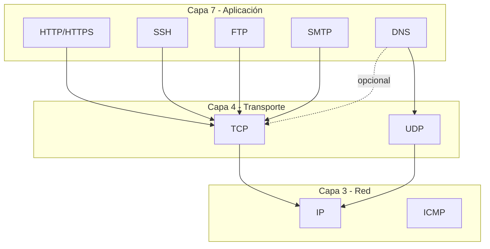
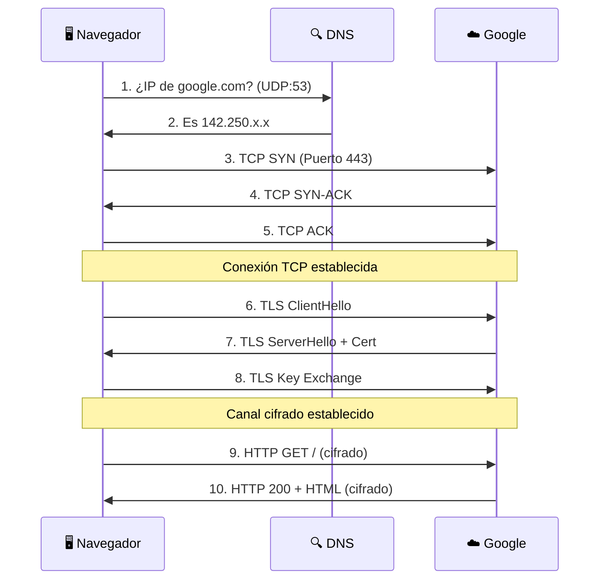

# Protocolos de Red

Los **protocolos** son las reglas y formatos que permiten a los dispositivos comunicarse. Es como el idioma que hablan las computadoras.

## 📚 Contenido

<div class="grid cards" markdown>

-   :material-dns:{ .lg .middle } **DNS**

    ---

    El directorio telefónico de internet

    [:octicons-arrow-right-24: Leer](dns.md)

-   :material-web:{ .lg .middle } **HTTP/HTTPS**

    ---

    Cómo funciona la navegación web

    [:octicons-arrow-right-24: Leer](http-https.md)

-   :material-console:{ .lg .middle } **SSH**

    ---

    Acceso remoto seguro

    [:octicons-arrow-right-24: Leer](ssh.md)

-   :material-protocol:{ .lg .middle } **Otros Protocolos**

    ---

    FTP, SMTP, ICMP y más

    [:octicons-arrow-right-24: Leer](other.md)

</div>

## 🗺️ Mapa de Protocolos



## 📊 Protocolos por Puerto

| Puerto | Protocolo | Capa | Uso |
|--------|-----------|------|-----|
| 20, 21 | FTP | 7 | Transferencia de archivos |
| 22 | SSH | 7 | Acceso remoto seguro |
| 23 | Telnet | 7 | Acceso remoto (inseguro) |
| 25 | SMTP | 7 | Envío de correo |
| 53 | DNS | 7 | Resolución de nombres |
| 80 | HTTP | 7 | Web sin cifrar |
| 110 | POP3 | 7 | Recibir correo |
| 143 | IMAP | 7 | Correo sincronizado |
| 443 | HTTPS | 7 | Web cifrada |
| - | ICMP | 3 | Ping, traceroute |

## 🔄 Flujo Típico de Navegación

Cuando visitas `https://google.com`:



## 🎯 Qué Verás en NetMentor

Para cada protocolo, NetMentor muestra información específica:

### DNS
```
UDP 192.168.1.100:54321 → 8.8.8.8:53
Info: Standard query A google.com
```

### HTTP/HTTPS
```
TCP 192.168.1.100:54322 → 142.250.185.14:443
Info: Application Data (cifrado)
```

### SSH
```
TCP 192.168.1.100:54323 → 192.168.1.50:22
Info: SSH-2.0-OpenSSH_8.9
```

## 📖 Profundiza

Selecciona un protocolo para aprender más:

1. **[DNS](dns.md)** - Entiende cómo se resuelven nombres
2. **[HTTP/HTTPS](http-https.md)** - Cómo funciona la web
3. **[SSH](ssh.md)** - Acceso remoto seguro
4. **[Otros](other.md)** - ICMP, FTP, SMTP y más
