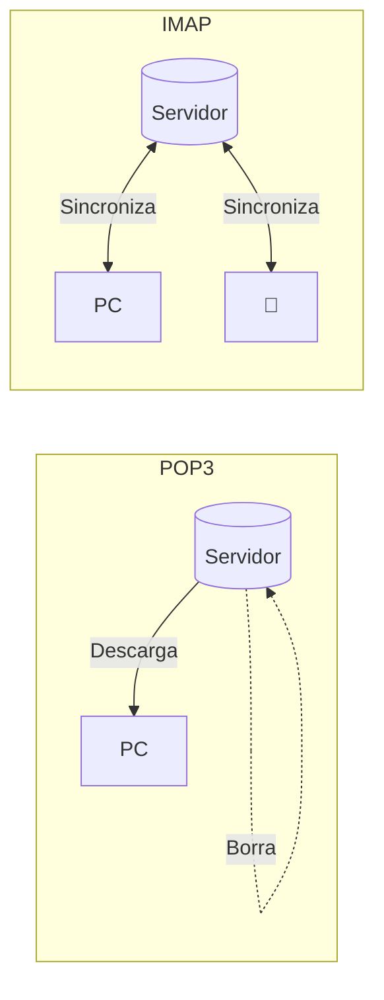
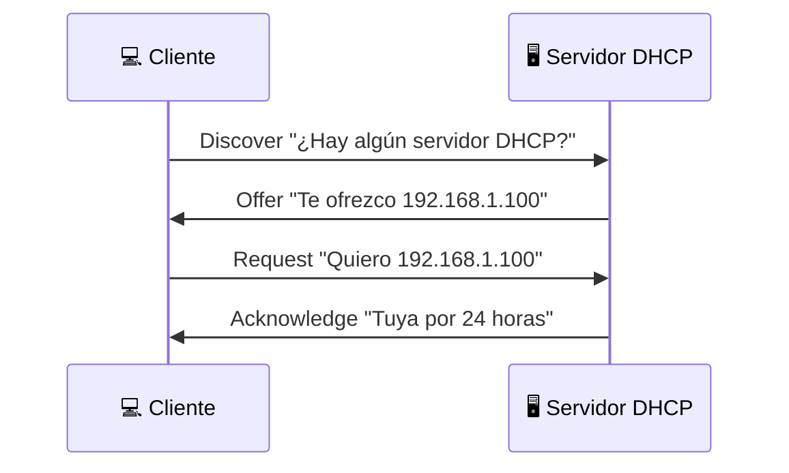

# Otros Protocolos

Guía rápida de otros protocolos comunes que verás en NetMentor.

## 🏓 ICMP - Internet Control Message Protocol

ICMP es usado para mensajes de control y diagnóstico de red.

### Tipos Comunes

| Tipo | Nombre | Uso |
|------|--------|-----|
| 0 | Echo Reply | Respuesta a ping |
| 3 | Destination Unreachable | No se puede llegar |
| 8 | Echo Request | Ping |
| 11 | Time Exceeded | TTL expirado (traceroute) |

### Ping

```bash
$ ping -c 4 google.com
PING google.com (142.250.185.14): 56 data bytes
64 bytes from 142.250.185.14: icmp_seq=0 ttl=117 time=12.3 ms
```

**En NetMentor:**
```
#1 | ICMP | 192.168.1.100 → 142.250.185.14 | Echo Request
#2 | ICMP | 142.250.185.14 → 192.168.1.100 | Echo Reply
```

### Traceroute

```bash
$ traceroute google.com
 1  192.168.1.1      1.234 ms
 2  10.0.0.1         5.678 ms
 3  ...
```

Funciona enviando paquetes con TTL incrementando:
- TTL=1 → primer router responde "Time Exceeded"
- TTL=2 → segundo router responde
- Y así hasta llegar al destino

## 📧 SMTP - Simple Mail Transfer Protocol

Protocolo para **enviar** correo electrónico.

### Puertos

| Puerto | Uso |
|--------|-----|
| 25 | SMTP estándar (bloqueado por muchos ISPs) |
| 465 | SMTPS (SSL implícito) |
| 587 | SMTP con STARTTLS (recomendado) |

### Conversación SMTP

```
Cliente: HELO mi-pc.local
Servidor: 250 Hello

Cliente: MAIL FROM:<yo@ejemplo.com>
Servidor: 250 OK

Cliente: RCPT TO:<destino@otro.com>
Servidor: 250 OK

Cliente: DATA
Servidor: 354 Start mail input

Cliente: Subject: Hola
Cliente: 
Cliente: Este es el mensaje.
Cliente: .
Servidor: 250 OK, message queued
```

### En NetMentor

```
#1 | TCP | 192.168.1.100:54321 → mail.ejemplo.com:587 | [SYN]
#2 | SMTP | 220 mail.ejemplo.com ESMTP
#3 | SMTP | EHLO mi-pc.local
```

!!! warning "Correo sin cifrar"
    Si ves SMTP en puerto 25 sin STARTTLS,
    ¡el contenido del correo es visible!

## 📥 IMAP/POP3 - Recibir Correo

### Diferencias

| Protocolo | Puerto | Seguro | Característica |
|-----------|--------|--------|----------------|
| POP3 | 110 | 995 | Descarga y borra del servidor |
| IMAP | 143 | 993 | Sincroniza con servidor |

### IMAP vs POP3



## 📁 FTP - File Transfer Protocol

Protocolo antiguo para transferencia de archivos.

### Puertos

| Puerto | Uso |
|--------|-----|
| 21 | Control (comandos) |
| 20 | Datos (modo activo) |
| Aleatorio | Datos (modo pasivo) |

### ⚠️ Problemas de Seguridad

!!! danger "FTP es inseguro"
    - Credenciales en texto plano
    - Datos sin cifrar
    - Usa **SFTP** (SSH) o **FTPS** (TLS) en su lugar

### En NetMentor

```
#1 | FTP | 220 Welcome to FTP server
#2 | FTP | USER anonymous
#3 | FTP | 331 Password required
#4 | FTP | PASS anonymous@  ← ¡Visible!
```

## 🕐 NTP - Network Time Protocol

Sincroniza el reloj del sistema.

### Puerto

- **123 UDP**

### En NetMentor

```
#1 | UDP | 192.168.1.100:54321 → time.apple.com:123 | NTP
```

### Ataque NTP Amplification

NTP puede usarse para DDoS:
- Petición pequeña (48 bytes)
- Respuesta grande (puede ser 500+ bytes)
- Atacante falsifica IP origen

## 🔍 DHCP - Dynamic Host Configuration Protocol

Asigna direcciones IP automáticamente.

### Puertos

- **67 UDP** - Servidor
- **68 UDP** - Cliente

### Proceso DORA



### En NetMentor

```
#1 | DHCP | Discover - Transaction ID 0x1234
#2 | DHCP | Offer - Your IP: 192.168.1.100
#3 | DHCP | Request - Requested IP: 192.168.1.100
#4 | DHCP | ACK - Your IP: 192.168.1.100
```

## 🔗 ARP - Address Resolution Protocol

Traduce IP a dirección MAC (capa 2).

### Funcionamiento

```
"¿Quién tiene 192.168.1.1?" (broadcast)
"Yo soy 192.168.1.1, mi MAC es aa:bb:cc:dd:ee:ff"
```

### En NetMentor

```
#1 | ARP | Who has 192.168.1.1? Tell 192.168.1.100
#2 | ARP | 192.168.1.1 is at aa:bb:cc:dd:ee:ff
```

### ⚠️ ARP Spoofing

!!! warning "Ataque común"
    Un atacante puede responder a ARP claims falsamente,
    redirigiendo tráfico hacia su máquina (MITM).

## 📊 Resumen de Puertos

| Puerto | Protocolo | Seguro | Uso |
|--------|-----------|--------|-----|
| 20, 21 | FTP | ❌ | Archivos |
| 22 | SSH/SFTP | ✅ | Remoto/Archivos |
| 23 | Telnet | ❌ | Remoto (obsoleto) |
| 25 | SMTP | ⚠️ | Enviar correo |
| 53 | DNS | ⚠️ | Nombres → IPs |
| 67, 68 | DHCP | ❌ | Asignar IPs |
| 80 | HTTP | ❌ | Web |
| 110 | POP3 | ❌ | Recibir correo |
| 123 | NTP | ❌ | Sincronizar hora |
| 143 | IMAP | ❌ | Correo sync |
| 443 | HTTPS | ✅ | Web segura |
| 465 | SMTPS | ✅ | Correo seguro |
| 587 | SMTP+TLS | ✅ | Correo con TLS |
| 993 | IMAPS | ✅ | Correo sync seguro |
| 995 | POP3S | ✅ | Recibir correo seguro |

## 💡 Práctica

### Capturar DHCP

1. **Libera tu IP**: `sudo dhclient -r`
2. **Inicia captura**
3. **Renueva IP**: `sudo dhclient`
4. **Busca** paquetes DHCP (puertos 67, 68)

### Ver ARP

```bash
# Ver tabla ARP actual
arp -a

# En NetMentor, verás ARP al comunicarte con IPs locales nuevas
```

### Capturar NTP

```bash
# Forzar sincronización
sudo sntp -sS time.apple.com

# Verás paquetes UDP al puerto 123
```
