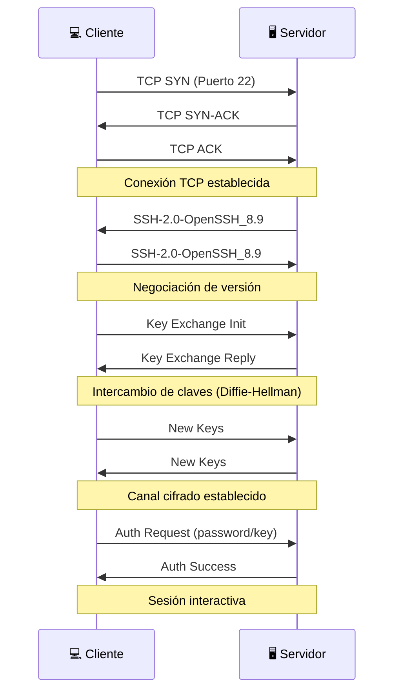

# SSH - Secure Shell

**SSH** (Secure Shell) es un protocolo para acceso remoto seguro a servidores y transferencia de archivos cifrada.

## 🔐 ¿Qué es SSH?

SSH te permite:

- 💻 **Conectarte** a servidores remotos
- 📁 **Transferir archivos** de forma segura (SCP, SFTP)
- 🚇 **Crear túneles** para otros protocolos
- 🔑 **Autenticarte** con claves en lugar de contraseñas

## 🔄 Cómo Funciona



## 📊 Componentes

### 1. Intercambio de Claves

Antes de enviar datos, cliente y servidor acuerdan una clave de sesión usando:

- **Diffie-Hellman** - Clave compartida sin transmitirla
- **ECDH** - Versión con curvas elípticas (más seguro)

### 2. Autenticación

| Método | Seguridad | Uso |
|--------|-----------|-----|
| **Contraseña** | ⭐⭐ | Simple pero vulnerable a fuerza bruta |
| **Clave Pública** | ⭐⭐⭐⭐⭐ | Recomendado, sin contraseña que robar |
| **Certificado** | ⭐⭐⭐⭐⭐ | Empresas, gestión centralizada |

### 3. Cifrado de Sesión

Todo el tráfico posterior está cifrado con:

- **AES-256-GCM** - Estándar actual
- **ChaCha20-Poly1305** - Alternativa moderna

## 🔑 Autenticación con Claves

### Generar Par de Claves

```bash
# Generar clave Ed25519 (recomendado)
ssh-keygen -t ed25519 -C "tu-email@ejemplo.com"

# O RSA 4096 bits
ssh-keygen -t rsa -b 4096 -C "tu-email@ejemplo.com"
```

Esto crea:
- `~/.ssh/id_ed25519` - Clave **privada** (¡NUNCA compartir!)
- `~/.ssh/id_ed25519.pub` - Clave **pública** (compartir libremente)

### Copiar al Servidor

```bash
# Método fácil
ssh-copy-id usuario@servidor

# O manualmente
cat ~/.ssh/id_ed25519.pub | ssh usuario@servidor \
  "mkdir -p ~/.ssh && cat >> ~/.ssh/authorized_keys"
```

### Conectar sin Contraseña

```bash
ssh usuario@servidor
# ¡Entra directamente!
```

## 🔍 En LeirEye

### Handshake Inicial

```
#1 | TCP | 192.168.1.100:54321 → 192.168.1.50:22 | [SYN]
#2 | TCP | 192.168.1.50:22 → 192.168.1.100:54321 | [SYN,ACK]
#3 | TCP | 192.168.1.100:54321 → 192.168.1.50:22 | [ACK]
```

### Identificación de Versión

```
#4 | SSH | Server: SSH-2.0-OpenSSH_8.9
#5 | SSH | Client: SSH-2.0-OpenSSH_8.9
```

### Intercambio de Claves

```
#6 | SSH | Key Exchange Init
#7 | SSH | Key Exchange Reply
#8 | SSH | New Keys
```

### Sesión Cifrada

```
#9  | SSH | Encrypted packet
#10 | SSH | Encrypted packet
...
```

Después del `New Keys`, todo es "Encrypted packet" - no puedes ver el contenido.

## 🛠️ Comandos Útiles

### Conexión Básica

```bash
# Conectar
ssh usuario@servidor

# Con puerto diferente
ssh -p 2222 usuario@servidor

# Ejecutar comando remoto
ssh usuario@servidor "ls -la /var/log"
```

### Transferencia de Archivos

```bash
# Copiar archivo al servidor
scp archivo.txt usuario@servidor:/ruta/destino/

# Copiar desde servidor
scp usuario@servidor:/ruta/archivo.txt ./

# Directorio completo
scp -r carpeta/ usuario@servidor:/ruta/
```

### SFTP (FTP sobre SSH)

```bash
sftp usuario@servidor
sftp> put archivo.txt
sftp> get archivo_remoto.txt
sftp> ls
sftp> quit
```

### Túnel SSH

```bash
# Port forwarding local
# Acceder a servidor:3306 como si fuera localhost:3306
ssh -L 3306:localhost:3306 usuario@servidor

# Port forwarding remoto
# Exponer tu localhost:8000 en servidor:8000
ssh -R 8000:localhost:8000 usuario@servidor
```

## 🛡️ Seguridad

### Configuración Segura del Servidor

```bash
# /etc/ssh/sshd_config

# Deshabilitar login con contraseña
PasswordAuthentication no

# Deshabilitar root login
PermitRootLogin no

# Solo permitir ciertos usuarios
AllowUsers admin deploy

# Cambiar puerto (opcional)
Port 2222
```

### Señales de Ataque

!!! warning "En LeirEye busca:"
    - Muchos intentos de conexión al puerto 22
    - Conexiones desde IPs desconocidas
    - Conexiones SSH a horas inusuales
    - Múltiples fallos de autenticación (en logs)

### Fuerza Bruta SSH

```
# Patrón típico de ataque
10:00:01 SSH connection from 1.2.3.4
10:00:02 SSH connection from 1.2.3.4
10:00:03 SSH connection from 1.2.3.4
10:00:04 SSH connection from 1.2.3.4
...
```

Mitigación:
- Usar claves en lugar de contraseñas
- Instalar `fail2ban`
- Cambiar puerto (seguridad por obscuridad)

## 💡 Práctica en LeirEye

### Experimento 1: Capturar Handshake SSH

1. **Inicia captura** en la interfaz correcta
2. **Ejecuta**:
   ```bash
   ssh usuario@localhost  # o a otro servidor
   ```
3. **Busca** paquetes al puerto 22
4. **Identifica**:
   - TCP handshake (SYN, SYN-ACK, ACK)
   - Versiones SSH
   - Key Exchange
   - Encrypted packets

### Experimento 2: Comparar con Telnet (Inseguro)

```bash
# Si tienes un servidor telnet (solo para pruebas!)
telnet servidor 23
```

Verás que en Telnet puedes leer **todo** el tráfico, incluyendo contraseñas.

### Experimento 3: Túnel SSH

1. **Crea túnel**:
   ```bash
   ssh -L 8080:ejemplo.com:80 usuario@servidor
   ```
2. **Captura** mientras navegas a `localhost:8080`
3. **Observa** que el tráfico a ejemplo.com va cifrado por SSH

## 📚 Recursos Adicionales

- [SSH.com Academy](https://www.ssh.com/academy/ssh) - Guía oficial
- [OpenSSH Manual](https://www.openssh.com/manual.html) - Documentación
- [SSH Hardening](https://www.sshaudit.com/) - Auditar configuración
