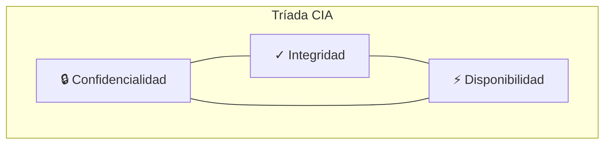
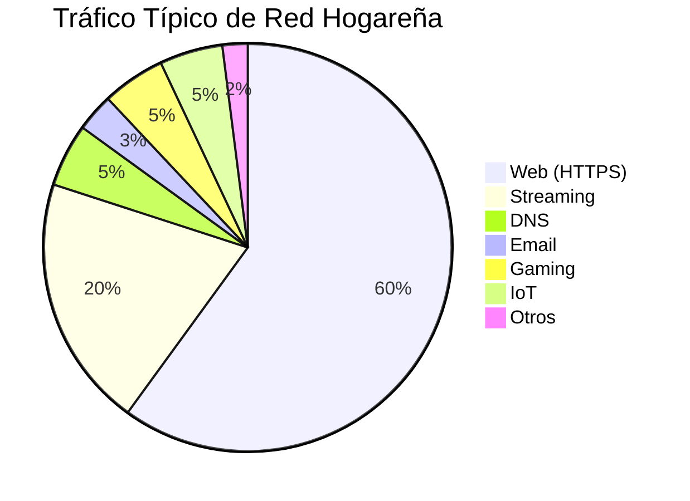
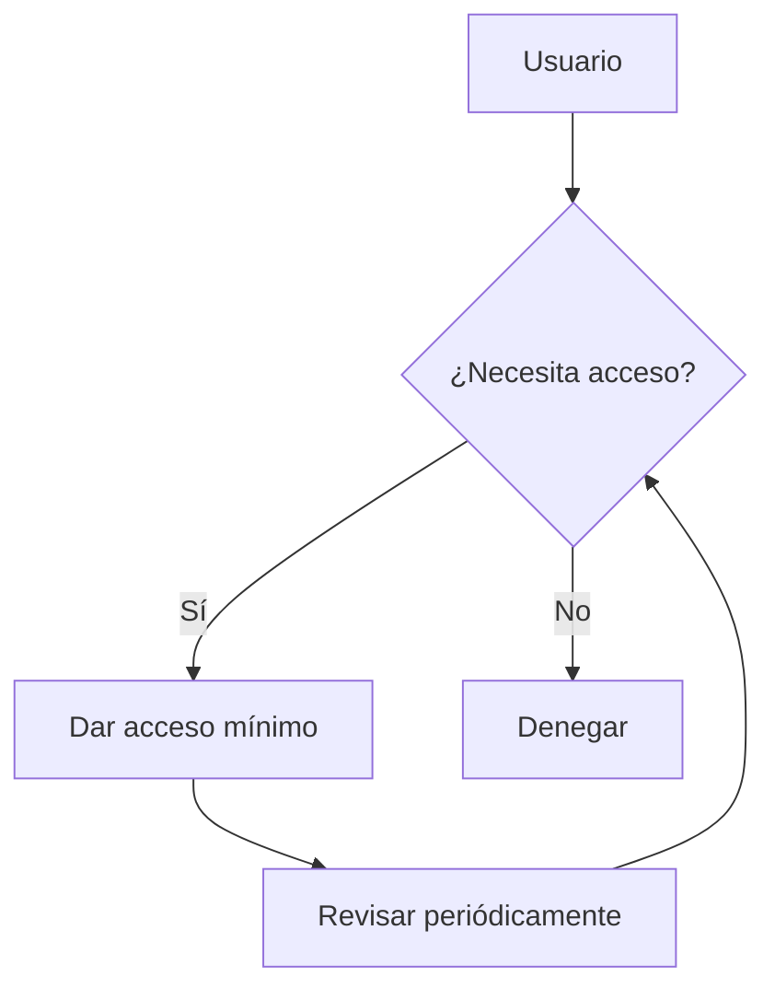

# Fundamentos de Seguridad en Redes

Conceptos esenciales de seguridad que necesitas entender para analizar tráfico de red efectivamente.

## 🔐 La Tríada CIA

Los tres pilares de la seguridad de información:



| Pilar | Significado | Ejemplo de Ataque |
|-------|-------------|-------------------|
| **Confidencialidad** | Solo autorizados ven los datos | Sniffing, MITM |
| **Integridad** | Datos no modificados | Inyección, tampering |
| **Disponibilidad** | Sistema accesible | DDoS, ransomware |

## 🎯 Modelo de Amenazas

### ¿Quién podría atacarte?

| Actor | Motivación | Sofisticación | Ejemplo |
|-------|------------|---------------|---------|
| **Script Kiddie** | Diversión, ego | Baja | Herramientas automáticas |
| **Hacker Ético** | Pruebas, bounties | Media-Alta | Pentesters |
| **Cibercriminal** | Dinero | Media-Alta | Ransomware, phishing |
| **Hacktivista** | Ideología | Media | Anonymous |
| **Estado-Nación** | Espionaje | Muy Alta | APTs |
| **Insider** | Venganza, dinero | Variable | Empleado descontento |

### Superficie de Ataque

Todo lo que un atacante puede ver o tocar:

```
┌─────────────────────────────────────────────────┐
│                 SUPERFICIE DE ATAQUE            │
├─────────────────────────────────────────────────┤
│ 🌐 Servicios expuestos (SSH, HTTP, etc.)       │
│ 📧 Email (phishing, attachments)               │
│ 🔌 Puertos abiertos                            │
│ 📱 Dispositivos IoT                            │
│ 👤 Usuarios (ingeniería social)                │
│ 💿 Software desactualizado                     │
└─────────────────────────────────────────────────┘
```

## 🔄 Fases de un Ataque

El modelo **Cyber Kill Chain**:


| Fase | En NetMentor verás... |
|------|----------------------|
| **Reconocimiento** | Escaneos de puertos, DNS queries |
| **Entrega** | Email con adjunto, descarga sospechosa |
| **Explotación** | Tráfico anómalo a servicios |
| **C2** | Beacons periódicos, DNS tunneling |
| **Exfiltración** | Grandes transferencias salientes |

## 🛡️ Defensa en Profundidad

Múltiples capas de protección:

```
┌─────────────────────────────────────────────────┐
│ 🌐 Perímetro (Firewall, WAF)                   │
├─────────────────────────────────────────────────┤
│ 🔐 Red (Segmentación, VLANs)                   │
├─────────────────────────────────────────────────┤
│ 💻 Host (Antivirus, EDR)                       │
├─────────────────────────────────────────────────┤
│ 📱 Aplicación (Autenticación, validación)      │
├─────────────────────────────────────────────────┤
│ 📊 Datos (Cifrado, backups)                    │
└─────────────────────────────────────────────────┘
```

## 🔍 Tipos de Tráfico

### Normal vs Sospechoso

| Característica | Normal | Sospechoso |
|----------------|--------|------------|
| **Destinos** | Conocidos (Google, CDNs) | IPs desconocidas |
| **Puertos** | Estándar (80, 443, 22) | Inusuales (4444, 8888) |
| **Horario** | Durante uso activo | 3 AM sin actividad |
| **Volumen** | Proporcional al uso | Picos inexplicables |
| **Patrón** | Variable, orgánico | Regular, mecánico |

### Categorías de Tráfico



## 🔐 Cifrado

### Por Qué Importa

| Sin cifrado | Con cifrado |
|-------------|-------------|
| Cualquiera puede leer tus datos | Solo tú y el destino |
| Contraseñas visibles | Contraseñas protegidas |
| Fácil de modificar (MITM) | Detecta modificaciones |

### En NetMentor

| Protocolo | Puerto | Contenido visible |
|-----------|--------|-------------------|
| HTTP | 80 | ✅ Todo |
| HTTPS | 443 | ❌ Solo metadatos |
| FTP | 21 | ✅ Incluyendo contraseñas |
| SSH | 22 | ❌ Solo handshake |
| DNS | 53 | ✅ Queries y respuestas |

## 🎭 Principio de Mínimo Privilegio

Solo dar acceso a lo necesario:



**Aplicación en redes:**

- Solo abrir puertos necesarios
- Segmentar redes por función
- VLANs para dispositivos IoT
- Firewall rules específicas

## 📊 Logs y Auditoría

### Qué Guardar

| Tipo | Información | Retención |
|------|-------------|-----------|
| **Firewall** | Conexiones bloqueadas/permitidas | 90 días |
| **DNS** | Queries realizados | 30 días |
| **Auth** | Logins exitosos/fallidos | 1 año |
| **Aplicación** | Errores, acciones críticas | 90 días |

### Análisis con NetMentor

NetMentor complementa tus logs:
- Captura el tráfico real (no solo logs)
- Permite análisis post-incidente
- Detecta lo que logs no capturan

## 💡 Práctica

### Ejercicio: Analizar tu Baseline

1. **Captura** 10 minutos de tu tráfico normal
2. **Identifica**:
   - Top 5 destinos más frecuentes
   - Puertos más usados
   - Patrones de tráfico
3. **Documenta** tu baseline
4. **Compara** con capturas futuras

### Preguntas para Reflexionar

- ¿Conoces todos los dispositivos en tu red?
- ¿Sabes qué servicios exponen?
- ¿Cuándo fue la última vez que cambiaste contraseñas?
- ¿Tienes backups actualizados?

## 📚 Recursos

- [OWASP](https://owasp.org/) - Seguridad en aplicaciones
- [NIST Cybersecurity Framework](https://www.nist.gov/cyberframework)
- [SANS Reading Room](https://www.sans.org/reading-room/)
- [Krebs on Security](https://krebsonsecurity.com/) - Noticias de seguridad
