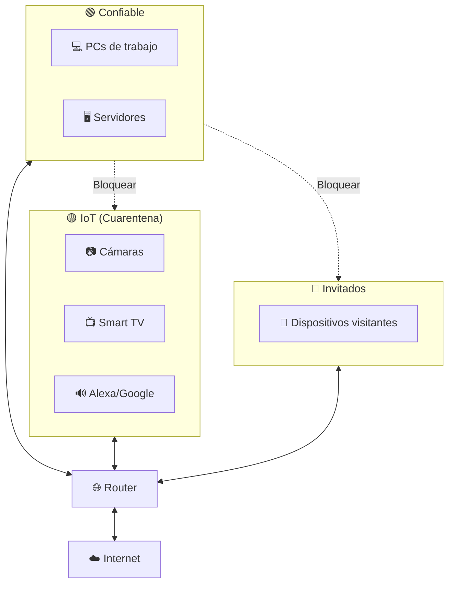
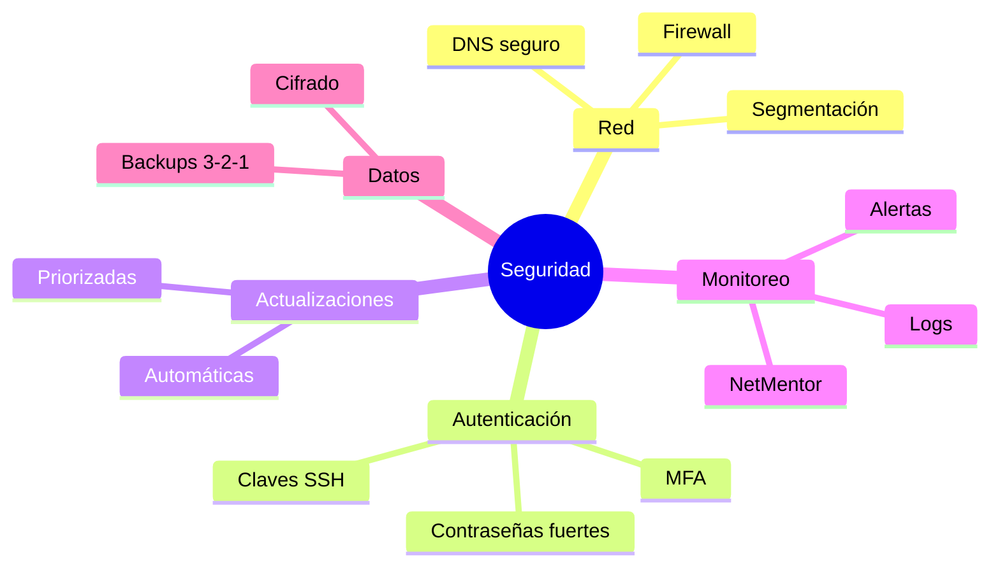

# Mejores Prácticas de Seguridad

Recomendaciones prácticas para proteger tu red.

## 🔐 Configuración de Red

### Firewall

```bash
# Política por defecto: bloquear todo entrante
# Solo permitir lo necesario

# macOS - Habilitar firewall
sudo /usr/libexec/ApplicationFirewall/socketfilterfw --setglobalstate on

# Verificar estado
sudo /usr/libexec/ApplicationFirewall/socketfilterfw --getglobalstate
```

**Reglas recomendadas:**

| Dirección | Puerto | Acción | Razón |
|-----------|--------|--------|-------|
| Entrante | * | DENEGAR | Por defecto |
| Entrante | 22 | PERMITIR (si necesitas SSH) | Acceso remoto |
| Saliente | * | PERMITIR | Navegación normal |
| Saliente | 4444, 31337 | DENEGAR | Puertos sospechosos |

### Segmentación de Red

Separa dispositivos por nivel de confianza:



### DNS Seguro

Usa DNS cifrado y con filtrado:

```bash
# Opciones de DNS seguro
# Cloudflare: 1.1.1.1 (rápido)
# Cloudflare for Families: 1.1.1.3 (bloquea malware)
# Quad9: 9.9.9.9 (bloquea amenazas)
# NextDNS: Custom (configurable)
```

## 🔑 Autenticación

### Contraseñas

| ✅ Hacer | ❌ Evitar |
|---------|-----------|
| +16 caracteres | Menos de 12 |
| Frases: "MiGatocome3Atunes!" | Palabras simples |
| Única por servicio | Reusar contraseñas |
| Gestor de contraseñas | Post-its, documentos |

### Autenticación Multi-Factor (MFA)

```
Algo que sabes (contraseña)
        +
Algo que tienes (teléfono, yubikey)
        =
Mucho más seguro
```

**Opciones MFA:**

| Tipo | Seguridad | Conveniencia |
|------|-----------|--------------|
| SMS | ⭐⭐ | ⭐⭐⭐⭐⭐ |
| TOTP (Google Auth) | ⭐⭐⭐⭐ | ⭐⭐⭐⭐ |
| Push (Duo) | ⭐⭐⭐⭐ | ⭐⭐⭐⭐⭐ |
| Hardware Key | ⭐⭐⭐⭐⭐ | ⭐⭐⭐ |

### SSH con Claves

```bash
# Generar clave (una vez)
ssh-keygen -t ed25519

# Copiar al servidor
ssh-copy-id usuario@servidor

# Deshabilitar login con contraseña
# En /etc/ssh/sshd_config:
# PasswordAuthentication no
```

## 🔄 Actualizaciones

### Prioridades

| Prioridad | Tipo | Acción |
|-----------|------|--------|
| 🔴 Crítica | Seguridad activamente explotada | Inmediata |
| 🟠 Alta | Seguridad sin exploits conocidos | 24-48 horas |
| 🟡 Media | Funcionalidad importante | Próxima ventana |
| 🟢 Baja | Mejoras menores | Cuando convenga |

### Automatización

```bash
# macOS - Actualizaciones automáticas
sudo softwareupdate --schedule on

# Verificar updates disponibles
softwareupdate -l
```

## 📊 Monitoreo

### Con NetMentor

**Rutina semanal:**

1. **Captura baseline** (10 min en horario normal)
2. **Revisa mapa de red** - ¿Dispositivos desconocidos?
3. **Analiza estadísticas** - ¿Patrones anómalos?
4. **Verifica top destinos** - ¿Conoces todas las IPs?

**Alertas automáticas (si implementas):**

| Evento | Umbral | Acción |
|--------|--------|--------|
| Nuevo dispositivo | 1 | Notificar |
| Puerto inusual | Cualquier tráfico a 4444, etc. | Alertar |
| Volumen anómalo | >3x promedio | Investigar |
| IP en blacklist | 1 conexión | Bloquear + alertar |

### Logs Importantes

```bash
# macOS - Ver logs de sistema
log show --predicate 'eventMessage contains "auth"' --last 1h

# Ver conexiones activas
netstat -an | grep ESTABLISHED

# Procesos con conexiones de red
lsof -i -P
```

## 🛡️ Endpoints

### Configuración Mínima

- [x] Firewall habilitado
- [x] Antivirus actualizado (Windows/macOS tiene integrado)
- [x] Cifrado de disco habilitado (FileVault/BitLocker)
- [x] Actualizaciones automáticas
- [x] Sin servicios innecesarios expuestos

### Verificar Servicios Expuestos

```bash
# Ver puertos en escucha
netstat -an | grep LISTEN

# Más detallado
lsof -i -P | grep LISTEN

# Verificar desde fuera
nmap -sV TuIP
```

## 🔒 Datos

### Cifrado

| Datos | Solución |
|-------|----------|
| En disco | FileVault (macOS), BitLocker (Windows) |
| En tránsito | HTTPS, VPN, SSH |
| Backups | Cifrar antes de subir a cloud |
| Contraseñas | Gestor de contraseñas (1Password, Bitwarden) |

### Backups

**Regla 3-2-1:**
- **3** copias de tus datos
- **2** medios diferentes (disco + cloud)
- **1** copia fuera de casa/oficina

```bash
# Ejemplo con rsync
rsync -avz --delete ~/Documents /Volumes/BackupDrive/

# Verificar backup
ls -la /Volumes/BackupDrive/Documents/
```

## 🌐 Navegación Segura

### Extensiones Recomendadas

| Extensión | Propósito |
|-----------|-----------|
| uBlock Origin | Bloquear ads y trackers |
| HTTPS Everywhere | Forzar HTTPS |
| Privacy Badger | Bloquear trackers |

### VPN

**Cuándo usar:**
- ✅ WiFi público (cafeterías, aeropuertos)
- ✅ Evitar geoblocking
- ✅ Privacidad del ISP

**Cuándo no es necesario:**
- Red de casa confiable
- Ya usando HTTPS (solo oculta destinos del ISP)

## 📋 Checklist de Seguridad

### Diario

- [ ] Revisar alertas de seguridad
- [ ] Verificar backups automáticos funcionando
- [ ] Cerrar sesiones no usadas

### Semanal

- [ ] Captura baseline con NetMentor
- [ ] Revisar mapa de red (dispositivos nuevos)
- [ ] Instalar actualizaciones pendientes
- [ ] Revisar logs de auth

### Mensual

- [ ] Auditar usuarios y permisos
- [ ] Probar restauración de backup
- [ ] Revisar reglas de firewall
- [ ] Escanear red propia con nmap

### Anual

- [ ] Rotar contraseñas críticas
- [ ] Revisar políticas de seguridad
- [ ] Actualizar plan de respuesta a incidentes
- [ ] Capacitación de seguridad

## 🚨 Respuesta a Incidentes

### Si Detectas Algo Sospechoso

1. **No entres en pánico**
2. **Documenta** - Captura pantalla, logs, tráfico
3. **Aísla** - Desconecta el dispositivo afectado
4. **Investiga** - ¿Qué pasó? ¿Cuándo empezó?
5. **Remedia** - Limpia o reinstala
6. **Aprende** - ¿Cómo prevenir en futuro?

### Contactos de Emergencia

Ten a mano:
- Número de tu ISP
- Contacto de soporte IT
- Número de tu banco (si hay fraude)
- Policía cibernética local

## 💡 Resumen



## 📚 Recursos

- [NIST Cybersecurity Framework](https://nist.gov/cyberframework)
- [CIS Controls](https://cisecurity.org/controls)
- [Have I Been Pwned](https://haveibeenpwned.com/) - Verificar brechas
- [PrivacyTools](https://privacytools.io/) - Herramientas de privacidad
