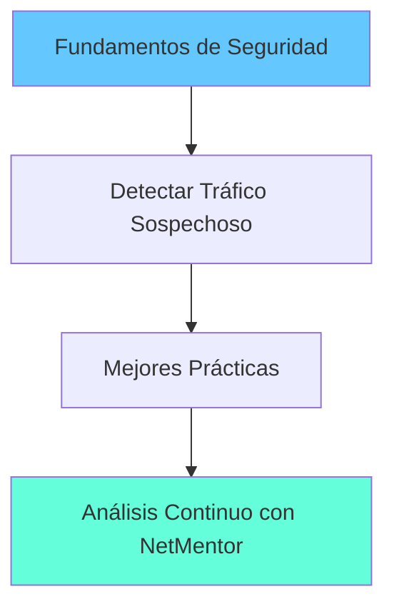

# Seguridad en Redes

Aprende a identificar amenazas y proteger tu red usando NetMentor.

## 🛡️ Contenido

-   :material-shield-account:{ .lg .middle } **Fundamentos de Seguridad**

    ---

    Conceptos básicos de seguridad en redes

    [:octicons-arrow-right-24: Leer](basics.md)

-   :material-alert:{ .lg .middle } **Detectar Tráfico Sospechoso**

    ---

    Cómo identificar actividad maliciosa

    [:octicons-arrow-right-24: Leer](suspicious-traffic.md)

-   :material-check-decagram:{ .lg .middle } **Mejores Prácticas**

    ---

    Recomendaciones para proteger tu red

    [:octicons-arrow-right-24: Leer](best-practices.md)

## 🎯 ¿Por Qué es Importante?

El análisis de tráfico de red te permite:

- 🔍 **Detectar** intrusos en tu red
- 🚨 **Identificar** malware comunicándose con servidores externos
- 📊 **Auditar** qué datos salen de tu red
- 🛡️ **Prevenir** fugas de información

## 🗺️ Ruta de Aprendizaje

## 📊 Tipos de Amenazas

| Categoría | Ejemplos | Qué buscar en NetMentor |
|-----------|----------|------------------------|
| **Reconocimiento** | Escaneo de puertos, ping sweep | Muchos SYN a diferentes puertos |
| **Acceso Inicial** | Exploits, credenciales robadas | Conexiones a puertos inusuales |
| **Persistencia** | Backdoors, malware | Tráfico periódico a IPs sospechosas |
| **Exfiltración** | Robo de datos | Grandes transferencias salientes |
| **C2** | Command & Control | DNS tunneling, beacons regulares |

## 🔴 Indicadores de Compromiso (IoC)

Señales de que algo está mal:

### Red

- ❌ Conexiones a IPs en listas negras
- ❌ Tráfico a países inesperados
- ❌ DNS a dominios recién creados
- ❌ Grandes volúmenes de datos salientes

### Comportamiento

- ❌ Actividad a horas inusuales (3 AM)
- ❌ Patrones regulares (beacon cada 60 segundos)
- ❌ Comunicación cifrada a puertos no estándar
- ❌ Múltiples conexiones fallidas

## 💡 Usando NetMentor para Seguridad

### Workflow de Análisis

1. **Captura baseline** - Tráfico normal durante operación
2. **Identifica patrones** - Qué es normal en tu red
3. **Detecta anomalías** - Lo que se desvía del baseline
4. **Investiga** - Usa IA para analizar paquetes sospechosos
5. **Documenta** - Guarda evidencia de incidentes

### Checklist de Seguridad

- [ ] ¿Hay dispositivos desconocidos en el mapa de red?
- [ ] ¿Hay conexiones a IPs que no reconozco?
- [ ] ¿Hay tráfico significativo en puertos inusuales?
- [ ] ¿Hay patrones de beacon regulares?
- [ ] ¿Hay DNS queries a dominios extraños?

## 🚀 Empezar

Te recomiendo este orden:

1. **[Fundamentos](basics.md)** - Entiende los conceptos básicos
2. **[Tráfico Sospechoso](suspicious-traffic.md)** - Aprende a detectar amenazas
3. **[Mejores Prácticas](best-practices.md)** - Protege tu red proactivamente
