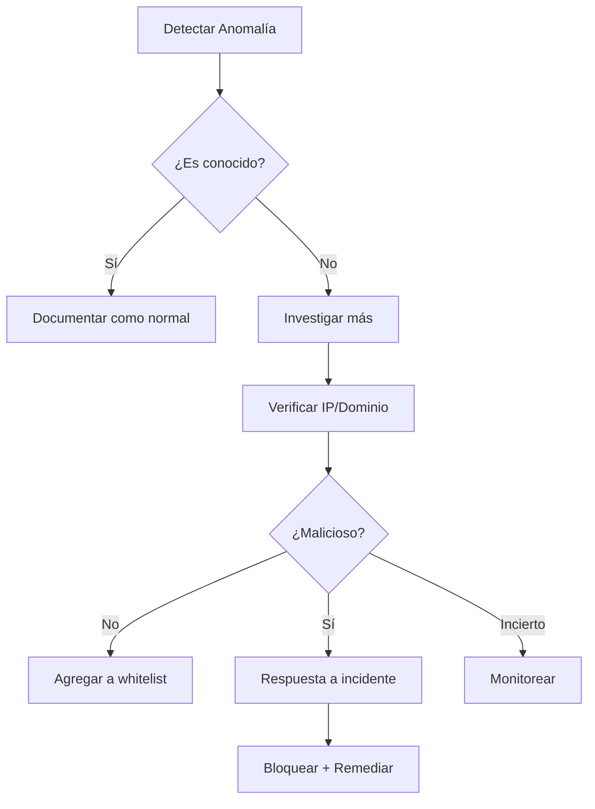

# Detectar Tráfico Sospechoso

Guía práctica para identificar actividad maliciosa en capturas de red.

## 🚨 Señales de Alerta

### 1. Escaneo de Puertos

**Qué es:** Atacante explorando qué servicios tienes abiertos.

**En LeirEye:**
```
#1 | TCP | 1.2.3.4:54321 → TuIP:21   | [SYN]
#2 | TCP | 1.2.3.4:54322 → TuIP:22   | [SYN]
#3 | TCP | 1.2.3.4:54323 → TuIP:23   | [SYN]
#4 | TCP | 1.2.3.4:54324 → TuIP:25   | [SYN]
#5 | TCP | 1.2.3.4:54325 → TuIP:80   | [SYN]
... (muchos más puertos)
```

**Señales:**
- ✅ Muchos SYN desde misma IP
- ✅ A diferentes puertos consecutivos
- ✅ Sin respuesta ACK (no completa conexión)

**Variantes:**
| Tipo | Característica |
|------|----------------|
| TCP Connect | Completa el handshake |
| SYN Scan | Solo envía SYN |
| FIN/XMAS/NULL | Flags inusuales para evadir detección |
| UDP Scan | Paquetes UDP a múltiples puertos |

### 2. Beacon/C2 (Command & Control)

**Qué es:** Malware "llamando a casa" para recibir instrucciones.

**En LeirEye:**
```
10:00:00 | TCP | TuIP → 1.2.3.4:443 | 128 bytes
10:01:00 | TCP | TuIP → 1.2.3.4:443 | 128 bytes
10:02:00 | TCP | TuIP → 1.2.3.4:443 | 128 bytes
10:03:00 | TCP | TuIP → 1.2.3.4:443 | 128 bytes
```

**Señales:**
- ✅ Intervalos regulares (cada 60 segundos exactos)
- ✅ Mismo tamaño de paquete
- ✅ Misma IP destino
- ✅ A horas sin actividad del usuario

**Visualización:**
```
Paquetes por minuto a 1.2.3.4
│ *     *     *     *     *     *     *
│
│
│
└─────────────────────────────────────────
  10:00 10:01 10:02 10:03 10:04 10:05 10:06
```

### 3. DNS Tunneling

**Qué es:** Exfiltrar datos o C2 disfrazado de tráfico DNS.

**En LeirEye:**
```
#1 | DNS | Query: aGVsbG8gd29ybGQ.evil.tk
#2 | DNS | Query: dGhpcyBpcyBkYXRh.evil.tk
#3 | DNS | Query: base64encodedstuff.evil.tk
```

**Señales:**
- ✅ Subdominios muy largos o aleatorios
- ✅ Muchas queries TXT
- ✅ Dominios poco conocidos (.tk, .pw, .xyz)
- ✅ Respuestas TXT inusualmente largas

**Comparación:**
```
# Normal
DNS Query: www.google.com
DNS Query: api.github.com

# Sospechoso (posible tunneling)
DNS Query: 3f2e8a9c7d6b5e4f.malicious.tk
DNS Query: YWJjZGVmZ2hpamtsbW5vcHFy.evil.pw
```

### 4. Exfiltración de Datos

**Qué es:** Robo de información hacia el exterior.

**En LeirEye:**
```
23:00:00 | TCP | TuIP → Desconocido:443 | 15 MB
23:00:30 | TCP | TuIP → Desconocido:443 | 20 MB
23:01:00 | TCP | TuIP → Desconocido:443 | 18 MB
```

**Señales:**
- ✅ Grandes transferencias salientes
- ✅ A horas inusuales
- ✅ A IPs no reconocidas
- ✅ Uso de puertos como 443 para parecer legítimo

**Estadísticas:**
```
Top Destinos por Volumen:
1. Desconocido.IP    | 500 MB ⚠️ (investigar)
2. Google           | 50 MB ✅
3. Microsoft        | 30 MB ✅
```

### 5. Fuerza Bruta

**Qué es:** Intentos repetidos de adivinar credenciales.

**En LeirEye:**
```
10:00:00 | SSH | 1.2.3.4 → TuIP:22 | Connection
10:00:01 | SSH | 1.2.3.4 → TuIP:22 | Connection
10:00:02 | SSH | 1.2.3.4 → TuIP:22 | Connection
10:00:03 | SSH | 1.2.3.4 → TuIP:22 | Connection
```

**Señales:**
- ✅ Muchas conexiones al mismo puerto auth (22, 3389)
- ✅ Desde misma IP o múltiples IPs
- ✅ Conexiones cortas (auth fallido)
- ✅ Alto volumen en poco tiempo

### 6. DDoS (Denegación de Servicio)

**Qué es:** Inundación de tráfico para saturar recursos.

**Señales entrantes:**
```
Paquetes/segundo
10000 │  ████████
      │  ████████
 1000 │  ████████
      │──████████──────────
  100 │  ████████
      │  ████████
   10 └──────────────────────
      Normal → Ataque → Normal
```

**Tipos comunes:**
| Tipo | Característica |
|------|----------------|
| SYN Flood | Miles de SYN sin ACK |
| UDP Flood | Paquetes UDP masivos |
| DNS Amplification | Respuestas DNS gigantes |
| HTTP Flood | Miles de requests |

### 7. ARP Spoofing

**Qué es:** Atacante se hace pasar por el gateway para interceptar tráfico.

**En LeirEye:**
```
#1 | ARP | 192.168.1.1 is at aa:bb:cc:dd:ee:ff (real)
#2 | ARP | 192.168.1.1 is at 11:22:33:44:55:66 (falso!)
```

**Señales:**
- ✅ Múltiples MACs para misma IP
- ✅ ARP gratuitos frecuentes
- ✅ Gateway con MAC diferente al router real

## 📊 Dashboard de Seguridad

### Métricas a Monitorear

| Métrica | Normal | Alerta |
|---------|--------|--------|
| Conexiones nuevas/min | 10-50 | >200 |
| DNS queries/min | 5-20 | >100 |
| Bytes salientes | Proporcional al uso | >100MB sin razón |
| IPs únicas destino | 20-50 | >200 nuevas |
| Puertos destino únicos | 5-10 | >50 |

### Checklist Diario

- [ ] ¿Hay nuevos dispositivos en el mapa de red?
- [ ] ¿Top IPs destino son conocidas?
- [ ] ¿Hay tráfico a puertos inusuales?
- [ ] ¿Estadísticas muestran patrones anómalos?
- [ ] ¿DNS queries van a dominios esperados?

## 🔍 Workflow de Investigación



### Herramientas de Verificación

```bash
# Información sobre IP
whois 1.2.3.4
curl ipinfo.io/1.2.3.4

# Verificar reputación
# VirusTotal: https://virustotal.com
# AbuseIPDB: https://abuseipdb.com
# Shodan: https://shodan.io

# DNS lookup
dig +short dominio-sospechoso.tk

# WHOIS de dominio
whois dominio-sospechoso.tk
```

## 💡 Práctica

### Ejercicio 1: Simular Escaneo

```bash
# SOLO en tu propia red/máquinas
nmap -sS localhost
```

Captura con LeirEye y observa el patrón.

### Ejercicio 2: Analizar Baseline

1. Captura 30 minutos de tráfico normal
2. Anota:
   - Top 10 IPs destino
   - Puertos más usados
   - Volumen típico por hora
3. Guarda como referencia

### Ejercicio 3: Buscar Anomalías

1. Compara captura nueva con baseline
2. Identifica:
   - IPs nuevas
   - Puertos nuevos
   - Cambios de volumen
3. Investiga diferencias

## 📚 Recursos

- [MITRE ATT&CK](https://attack.mitre.org/) - Framework de tácticas
- [Malware Traffic Analysis](https://malware-traffic-analysis.net/) - Capturas reales
- [Security Onion](https://securityonion.net/) - Plataforma de monitoreo
