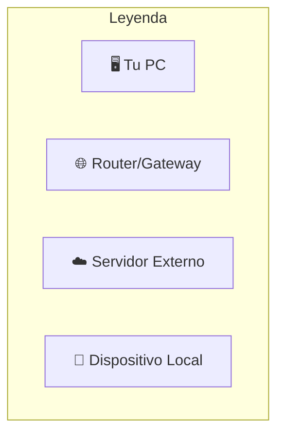
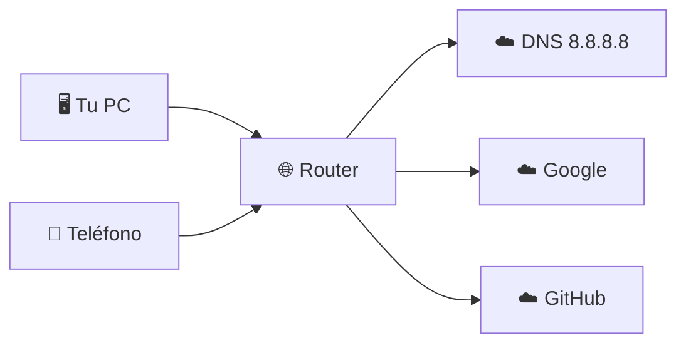

# Mapa de Red

El mapa de red proporciona una visualización interactiva de la topología de tu red basándose en el tráfico capturado.

## 🗺️ Vista General

El mapa muestra:

- **Nodos**: Dispositivos detectados (IPs)
- **Conexiones**: Comunicaciones entre dispositivos
- **Flujos**: Dirección y volumen del tráfico

## 🎨 Elementos Visuales

### Nodos (Dispositivos)

| Icono | Tipo | Descripción |
|-------|------|-------------|
| 🖥️ | Local | Tu máquina (origen de captura) |
| 🌐 | Gateway | Router, punto de acceso |
| ☁️ | Externo | Servidores de internet |
| 📱 | LAN | Otros dispositivos en tu red |
| ❓ | Desconocido | IP sin identificar |

### Conexiones (Líneas)

- **Grosor**: Volumen de tráfico (más grueso = más datos)
- **Color**: Tipo de protocolo
  - 🟢 TCP
  - 🔵 UDP
  - 🟡 Mixto
- **Flechas**: Dirección del flujo

## 🔍 Interacción

### Zoom y Pan

- **Scroll**: Zoom in/out
- **Arrastrar fondo**: Mover vista
- **Doble clic**: Centrar en nodo

### Seleccionar Nodo

Clic en un nodo para ver:

1. **Información del dispositivo**
   - Dirección IP
   - Hostname (si se resuelve)
   - Tipo detectado

2. **Estadísticas de conexión**
   - Paquetes enviados/recibidos
   - Bytes transferidos
   - Protocolos usados

3. **Conexiones activas**
   - Lista de IPs con las que comunica
   - Puerto más usado

### Seleccionar Conexión

Clic en una línea para ver:

- IPs involucradas
- Protocolo principal
- Volumen de datos
- Tiempo de actividad

## 📊 Casos de Uso

### Descubrir Topología de Red

1. Inicia una captura de 5-10 minutos
2. Navega normalmente (genera tráfico)
3. Abre el mapa de red
4. Visualiza cómo fluyen tus datos

### Identificar Dispositivos Desconocidos

1. Revisa todos los nodos del mapa
2. ¿Hay IPs que no reconoces?
3. Clic en el nodo para investigar
4. Revisa con qué se comunica

!!! warning "Dispositivo Sospechoso"
    Si ves un nodo con muchas conexiones externas
    y no lo reconoces, podría ser:
    
    - Dispositivo IoT mal configurado
    - Intruso en tu red
    - Malware exfiltrando datos

### Detectar Conexiones Anómalas

Busca patrones inusuales:

- ❌ Dispositivo interno → Múltiples IPs externas desconocidas
- ❌ Conexiones directas que saltan el gateway
- ❌ Tráfico constante a IPs sospechosas

### Optimizar Red

1. Identifica cuellos de botella
2. ¿Todo pasa por un solo nodo?
3. ¿Hay conexiones que podrían ser locales pero van por internet?

## 🎛️ Controles

### Filtros de Visualización

- **Por protocolo**: Mostrar solo TCP, UDP, o ambos
- **Por volumen**: Ocultar conexiones con poco tráfico
- **Por tipo**: Solo locales, solo externos, todos

### Layout

Elige el algoritmo de disposición:

| Layout | Mejor Para |
|--------|-----------|
| **Jerárquico** | Redes con estructura clara |
| **Fuerza** | Redes peer-to-peer |
| **Circular** | Visualizar hub central |
| **Grid** | Muchos nodos |

### Exportar

- **PNG/SVG**: Imagen del mapa
- **JSON**: Datos de nodos y conexiones

## 💡 Tips

!!! tip "Captura Prolongada"
    Para un mapa más completo, captura durante más tiempo.
    Más tráfico = más conexiones detectadas.

!!! tip "Combinar con Estadísticas"
    Usa las estadísticas para identificar IPs relevantes,
    luego búscalas en el mapa para ver contexto.

!!! tip "Refresh"
    El mapa se actualiza con nuevos paquetes.
    Puedes pausar la actualización para analizar.

## 🔧 Troubleshooting

??? warning "El mapa está vacío"
    1. ¿Hay paquetes capturados?
    2. ¿La captura está activa?
    3. ¿Hay tráfico de red real?

??? warning "Demasiados nodos"
    Usa filtros para reducir:
    - Ocultar conexiones menores
    - Filtrar por protocolo
    - Agrupar por subred
