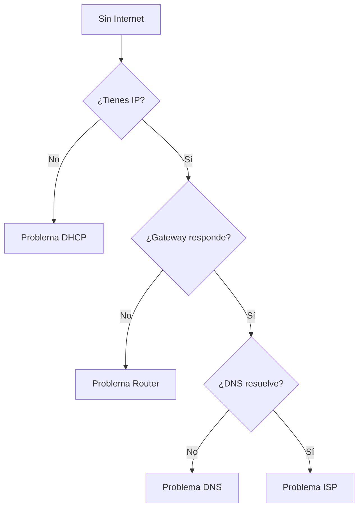

# Información del Sistema

El módulo de Sistema proporciona información sobre tu máquina y configuración de red.

## 📊 Información Disponible

### Sistema Operativo

| Campo | Descripción | Ejemplo |
|-------|-------------|---------|
| **OS** | Sistema operativo | macOS 14.2.1 |
| **Kernel** | Versión del kernel | Darwin 23.2.0 |
| **Arquitectura** | CPU architecture | arm64 |
| **Hostname** | Nombre del equipo | MacBook-Pro.local |

### Hardware

| Campo | Descripción | Ejemplo |
|-------|-------------|---------|
| **CPU** | Procesador | Apple M2 Pro |
| **Cores** | Núcleos | 10 cores |
| **RAM** | Memoria total | 16 GB |
| **RAM Libre** | Memoria disponible | 8.2 GB |

### Interfaces de Red

Lista de todas las interfaces con:

```
┌─────────────────────────────────────────────────────┐
│ Interface: en0 (WiFi)                               │
├─────────────────────────────────────────────────────┤
│ IPv4: 192.168.1.100                                 │
│ IPv6: fe80::1                                       │
│ MAC: a4:83:e7:xx:xx:xx                              │
│ Estado: Activa ✅                                   │
│ MTU: 1500                                           │
└─────────────────────────────────────────────────────┘
```

### Gateway y DNS

| Campo | Valor |
|-------|-------|
| **Gateway** | 192.168.1.1 |
| **DNS Primario** | 8.8.8.8 |
| **DNS Secundario** | 8.8.4.4 |
| **Dominio** | home.local |

## 🔧 Uso de la Información

### Seleccionar Interfaz Correcta

1. Revisa la lista de interfaces
2. Identifica cuál tiene IP válida
3. Usa esa interfaz para captura

!!! tip "Interfaz Activa"
    La interfaz correcta usualmente tiene:
    
    - IP en rango privado (192.168.x.x, 10.x.x.x)
    - Estado "Activa"
    - Gateway configurado

### Diagnóstico de Red

Usa esta información para:

1. **Verificar conectividad**: ¿Tienes IP asignada?
2. **Identificar gateway**: ¿Cuál es tu router?
3. **Revisar DNS**: ¿Están configurados correctamente?

### Troubleshooting



## 👥 Gestión de Usuarios

### Roles del Sistema

| Rol | Descripción | Permisos |
|-----|-------------|----------|
| **ADMIN** | Administrador | Todo acceso |
| **ANALYST** | Analista | Captura + análisis |
| **VIEWER** | Observador | Solo lectura |

### Tu Perfil

Muestra:
- **Username**: Tu nombre de usuario
- **Email**: Correo registrado
- **Rol**: Nivel de acceso
- **Creado**: Fecha de registro
- **Último acceso**: Última conexión

### Acciones de Usuario

| Acción | Descripción | Rol Requerido |
|--------|-------------|---------------|
| Ver perfil | Ver tu información | Todos |
| Cambiar contraseña | Actualizar password | Todos |
| Gestionar usuarios | Crear/editar usuarios | ADMIN |
| Ver logs | Auditoría del sistema | ADMIN |

## 📊 Métricas del Sistema

### Uso de Recursos

Monitoreo en tiempo real de:

- **CPU**: Porcentaje de uso
- **RAM**: Memoria utilizada
- **Disco**: Espacio disponible
- **Red**: Bytes in/out

### Estado de Servicios

| Servicio | Estado | Puerto |
|----------|--------|--------|
| Backend API | ✅ Online | 8000 |
| PostgreSQL | ✅ Online | 5432 |
| Redis | ✅ Online | 6379 |
| Ollama | ✅ Online | 11434 |
| Frontend | ✅ Online | 3001 |

## ⚙️ Configuración

### Variables de Entorno

Configuraciones actuales del backend:

| Variable | Valor | Descripción |
|----------|-------|-------------|
| `DEBUG` | false | Modo desarrollo |
| `LOG_LEVEL` | INFO | Nivel de logs |
| `CORS_ORIGINS` | localhost:3001 | Frontend permitido |

### Versiones

| Componente | Versión |
|------------|---------|
| LeirEye | 2.0.0 |
| Python | 3.11.x |
| Node.js | 18.x |
| PostgreSQL | 15.x |

## 🔒 Seguridad

### Sesión Actual

- **Token**: JWT válido por 30 min
- **Refresh**: Auto-renovación activa
- **IP de origen**: Tu IP actual

### Acciones de Seguridad

- 🔐 **Cerrar sesión**: Invalida tokens
- 🔄 **Rotar tokens**: Genera nuevos tokens
- 📝 **Ver actividad**: Historial de acciones

## 💡 Tips

!!! tip "Mantenimiento"
    Revisa periódicamente:
    
    - Espacio en disco
    - Uso de memoria
    - Logs de errores

!!! tip "Seguridad"
    Como ADMIN:
    
    - Revisa usuarios activos
    - Elimina cuentas inactivas
    - Monitorea accesos sospechosos
